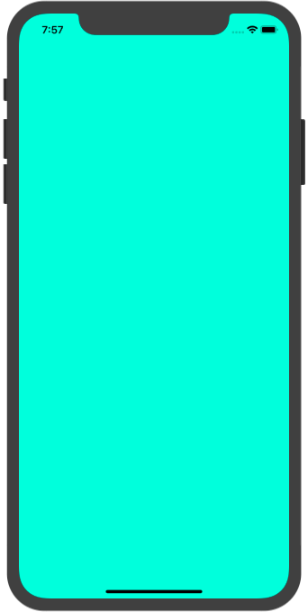
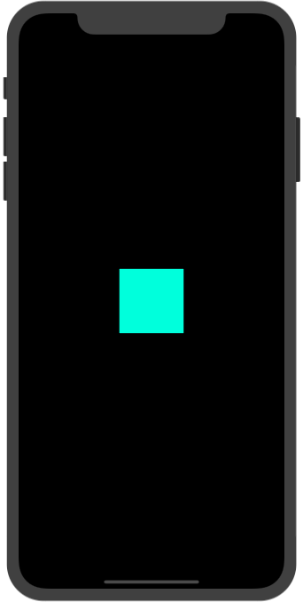
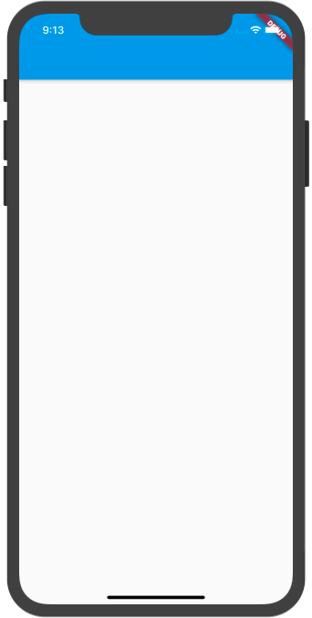
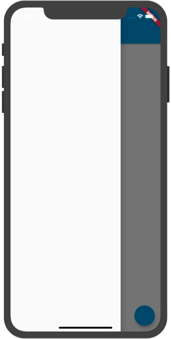
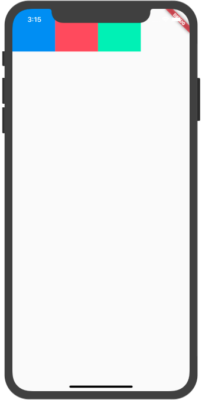
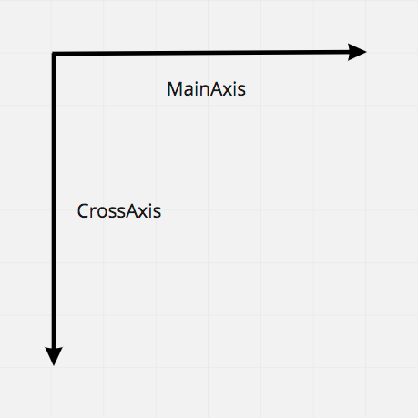
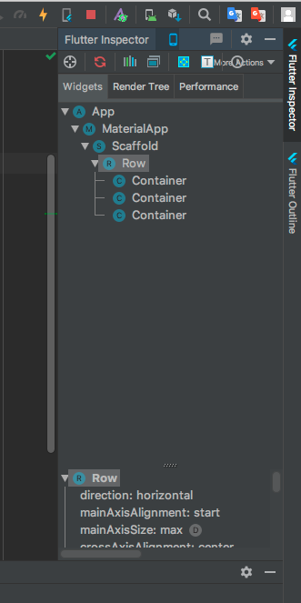
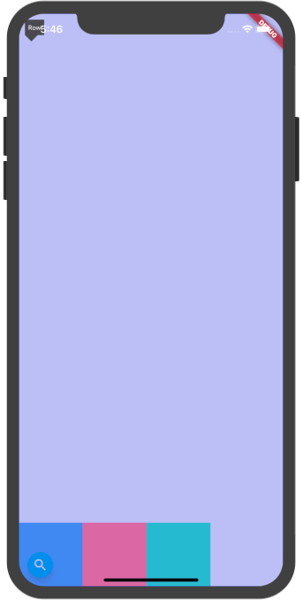

# X - Everything is Widgets 

## 前言

对于 Flutter，Google 将它定义为 一个移动 UI 工具包。跨平台只是 Flutter 基本属性的一部分，它最重要的工作，就是能够让开发者快速开发出一套精美的 UI。也许你已经听说过，在 Flutter 中 Everything is Widget，几乎所有的 UI 部分都是通过 Widget 来进行构建。为了能够为开发者提供更快的构建速度，Flutter 可以说是自带了一堆组件供开发者使用。然而当我们刚接触这个框架，常常会感到窒息，这么多 Widget 怎么学？似乎一些界面这个 Widget 做，另外的好像也可以，如何选择。深层次复杂的嵌套让人望而却步，怎样避免？以及如何来优化我们界面的性能？

实际上 Widget 有很多相通之处，当你对其中的基本组件熟悉之后，你会发现这种构建 UI 的方式非常的灵活、自由，能够让我们真正无拘无束地开发出奇妙的 UI 而不只是局限常规。任何复杂的事物都是由简单的事物堆积而成，在本章我将带领各位读者庖丁解牛地学习 Flutter 中的 Widgets，不仅会介绍重要 API，更多的结合实际场景的应用，通过这一章的学习，各位读者将能够拥有 快速上手任何 Widget 的能力。

# X.1 基本 Widget
界面可以说是和用户最近的地方，一个精美的用户界一下就会吸引用户，这也是接触 Flutter 开发最有趣的一部分。通常拿到一个设计图，作为 UI 开发者我们首先考虑的是这两个问题：屏幕上应该有什么？它们又该放在哪？布局和显示被拆分成了两个问题，让后我们分别进行解决。

对于 Flutter 来说这个问题被分解的相当彻底：一些组件只用于显示，例如按钮，文字，图片等，而另外一些组件不显示任何东西，他们的作用是对子组件进行布局，例如 行布局组件（row），列布局组件（column），单 child 对齐组件（align）。通过层级关系组成一个精美的页面。

## X.1.1 初识 Flutter

说了这么多看上去都很抽象，让我们开始第一个小 Demo 入门 Flutter 吧！首先我们创建一个新的项目，相信通过之前的学习这对你已经是小菜一碟。当你完成创建之后，我们将删除所有 main.dart 的代码内容，从零开始编写 Flutter 应用程序。

首先第一步，你需要添加最基本的 material 库的依赖，他为我们提供了完整的 material 风格的组件。

``` dart
import 'package:flutter/material.dart';
```

Flutter 具有单一函数入口，也就是经常说的 `main` 函数。那么我们现在开始

编写 main 函数。

``` dart
void mian(){
  runApp();
}
```

当你写完上面代码时，`runApp` 处会报错，没错我们现在就来处理它。`runApp` 函数从名字你很直观的能够感受到这个函数的作用就是运行一个 APP。而这里我们必须传一个 Widget。

现在问题来了，究竟什么是 Widget 呢？ 简要来说它就是我们 Flutter 中对界面的描述信息。我们先来创建第一个 Widget。

首先你需要创建一个类，我们这里把这个类叫做 App，然后让它继承至 `StatelessWidget` 类。就像这样。

``` dart
class App extends StatelessWidget{}
```

当你写完这句代码之后你的 App 类就能够创建出 Widget 了，但是没错，它的报错又多了，哈哈，我们马上就会解决它。

在 Widget 中存在着一个必须重写的 build 方法，让我们继续完成这段代码。

``` dart
class App extends StatelessWidget {
  Widget build(BuildContext context) {
    return Container();
  }
}
```

Build 方法是我们构建视图的地方，它将会返回一个 Widget，并传入一个 BuildContext 参数。现在我们暂时抛开 BuildContext 不谈，仅仅作为基本了解就好。然后在这个函数中，我们返回一个 Container ，一个最基本的 Widget。

如果你觉得这段代码手敲起来太麻烦，那么你可以使用快捷键生成。只需要在任意新行敲下 stl 然后按下回车 你的 IDE 就会自动帮你生成下面这段代码。

``` dart
class  extends StatelessWidget {
  @override
  Widget build(BuildContext context) {
    return Container();
  }
}
```

然后你只需要填写一个类名就好了。是不是非常方便呢。

好了让我们继续回到正题，现在我们已经有了一个 Widget，那么就可以将它放进 `runApp` 函数中了，整体代码如下。(为了让这个 Container 更加容易分辨，我们将其 color 属性设置为 tealAccent)

``` dart
import 'package:flutter/material.dart';

void main(){
  runApp(App());
}

class App extends StatelessWidget {
  @override
  Widget build(BuildContext context) {
    return Container(
      color: Colors.tealAccent,
    );
  }
}
```

麻雀虽小，五脏俱全，没错就是这么几行代码，你的 Flutter 应用已经完全准备好啦，现在你可以运行你的程序。当你的编译完成并安装好了之后，我们将会看到这样一个应用。



是不是比你想象中要简单很多呢，让我们继续深入吧。我们来试着向这个 Container中添加一些基本属性。现在我想要这个 Container 变成一个 高 100 dp，宽 100 dp 的小正方形，于是添加如下代码。

```dart
  Widget build(BuildContext context) {
    return Container(
      height: 100,
      width: 100,
      color: Colors.tealAccent,
    );
  }
```

然后你可以使用 '保存' 快捷键进行 hot reload。（在 Windows 上是 ctrl + s，Mac 上则是 command + s）在你的控制台应该会看到如下信息。

``` 
Performing hot reload...
Syncing files to device iPhone XR...
Reloaded 0 of 646 libraries in 69ms.
```

说明我们已经刷新成功了，但是看看你的应用，好像并没有发生任何变化，这是为什么呢。 在 Flutter 中我们使用 Widget 组合来拼接成一个页面，Flutter 就需要知道两件事：1.这个组件长什么样 2. 这个组件应该被放置在哪。

现在我们已经告诉 Flutter 我们需要在屏幕上显示一个 Container ，然而我们并没有告诉它因该显示在哪，所以这个 Container 由于自身的 约束条件被拉伸并铺满了整个屏幕。

既然我们已经知道了问题，那么该如何告诉 Flutter Container 的位置呢。在 Flutter 中 Widget 自己是不知道自己的位置的，它的位置由它的父亲节点所决定。而这时候就需要一组专门的组件用于的布局组件了。

在这个例子中，我们想要将让这个 Container 有 100 * 100 的宽高，而且居中显示。所以需要用到 Center Widget。用法很简单，在你想要让它居中的 Widget 外套一个 Center 就可以了，代码如下。

``` dart
Widget build(BuildContext context) {
    return Center(
      child: Container(
        height: 100,
        width: 100,
        color: Colors.tealAccent,
      ),
    );
  }
```

然后再使用快捷保存按钮进行 hot reload，你的应用将会快速刷新，像下面这样。



### 探索练习

Cool！你现在可以在这个方块上进行自由探索，更改它的长度/宽度/颜色，看看会有什么变化。

## X.1.2 使用 Scaffold 快速搭建页面

在上一章我们已经带大家动手做了第一个 Flutter 小程序，虽然很简单，但是已经让我们对 Flutter 有了一个初步的印象了！而现在我们要做一个相对正式的 App，还记得我们之前提到的 Google 的设计守则 Material Design 吗，为了在应用中快速的搭建起 Materila 风格的页面，Flutter 为我们提供了一个 优秀的组件 ——MaterialApp，只需要使用它就可以快速获得非常多的基础能力，可以说是必不可少的一个组件。既然谈到了 Material 设计风格，那我想要使用 Apple 的设计风格怎么办呢，同样的 Flutter 也提供了一个叫做 CupertinoApp 的 Widget 组件，你可以把它看成 MaterialApp 的 Apple 设计风格版本。但是现在我们不深入去探究它，先看看如何使用吧。

``` dart
class App extends StatelessWidget {
  @override
  Widget build(BuildContext context) {
    return MaterialApp();
  }
}
```

我们和之前一样，创建一个叫做 App 的类并继承至 Stateless Widget，在 build 方法中我们返回一个 MaterialApp。它没有任何的界面，纯粹作为功能组件使用。现在我们想要快速的 搭建起一套基础界面，就像下面这样。


这是一个非常常见的一种 Material 设计布局方式，顶部有一个导航栏，左边有一个可以点开的抽屉，下面有一个浮动按钮。为了让开发者们能够更加方便的快速搭建起这样一个布局，Flutter 为我们提供了一个 脚手架 —— Scaffold。一开始我其实也不太习惯这个名字，似乎是建筑工地修房子，就会先搭建起一个脚手架，然后就可以沿着这个架子慢慢往上修。在这里你可以把它就想像成一张纸，纸张背面已经为我们规划好了一些常见的布局位置，而我们只需要把想要的位置选出来然后把组件放上去，就可以了。听上去好像很简单，让我们来试试吧。

在我们的 MaterialApp 的 home 属性上，放置一个 Scaffold。

```dart
Widget build(BuildContext context) {
    return MaterialApp(
      home: Scaffold()
    );
  }
```

现在你的界面应该会是一片空白，现在我们要来完成第一个任务，制作一个顶部导航栏。在 Flutter 中，顶部这块蓝色的导航 我们把它称作 AppBar。在之前的一章我们曾说过，Flutter 不仅需要知道这个 Widget 长什么样。而且还需要知道 它在哪。幸运的是我们这两件事都不需要我们从零开始编写代码了，Scaffold 已经为我们规划好了 AppBar 的位置，而 AppBar 也是已经写好的组件。现在我们要做的就只是把这个 AppBar 放在 Scaffold 的 appBar 属性上。

``` dart
Widget build(BuildContext context) {
    return MaterialApp(
      home: Scaffold(
        appBar: AppBar(),
      )
    );
  }
```

是不是很简单呢，现在我们 hot reload 一下，你的界面上应该会变成这样。



同样的，我们的左部抽屉和底部的浮动按钮与AppBar 一样，Scaffold 也为它们提供了相应的位置，只需要在对应属性上放入相应对象即可。

``` dart
Widget build(BuildContext context) {
    return MaterialApp(
      home: Scaffold(
        appBar: AppBar(),
        drawer: Drawer(),
        floatingActionButton: 
        FloatingActionButton(onPressed: null),
      )
    );
  }
```



然后你就可以看到你的界面上已经具有一个顶部的 AppBar 左边有一个可以通过滑动弹出来的 Drawer，以及底部的 FloatingActionButton 了。一切都那么自然，搭建一个界面就是这么简单。

现在我们还剩最后一件事没有做，在屏幕中心我们想要显示一段文字，内容是"Hello Flutter！"。我们现在可以看到 Scaffold 的 appBar 下面有一块白色区域，这里是 Scaffold 的 body 部分，我们可以在这里进行进行自定义的布局。

在 Flutter 中显示一段文字则需要使用到 Text Widget。我们将编写下面这段代码实现此效果。

``` dart
Widget build(BuildContext context) {
    return MaterialApp(
      home: Scaffold(
        appBar: AppBar(),
        drawer: Drawer(),
        floatingActionButton: 
        FloatingActionButton(onPressed: null),
        body: Center(
          child: Text('Hello Flutter!'),
        ),
      )
    );
  }
```

使用 Text Widget 很简单，只需要向 Text Widget 的构造函数 传入一个字符串就好了。

## X.1.3 基本的布局组件 Column / Row

在上一节我们已经接触到了 Flutter 的 两个最常见的部件 MaterialApp 以及 Scaffold。你肯定已经对 Flutter 构建界面的方式有了一个初步印象了，非常不错。在这一节中我们将会学习 Flutter 的两个最基本的布局控件 Column 和 Row。可以说大部分的布局都将依赖于行布局/列布局来进行实现。

要学习行/列布局，首先我们需要了解它的主轴/横轴。为什么要有这两根轴呢？我们来想一想，假如你有三个不同颜色的方块需要摆在屏幕上，它们分别都是 100 * 100 的宽度，你要怎么描述它的位置呢。其实初中学过直角坐标系我们都知道，要准确描述位置我们至少需要相互垂直的两根轴的数据才行。所以理解这两根轴就成了掌握 Row / Column 布局关键。

我们先从行布局入手，逐步讲解这两条轴。（Row）首先第一步还是还原代码基础部分。我们之后都会在 Scaffold 的 body 内部构件 UI。

``` dart
class App extends StatelessWidget {
  @override
  Widget build(BuildContext context) {
    return MaterialApp(
        home: Scaffold(
      		body: Row(
        		children: <Widget>[
          		Container(
            		width: 100,
            		height: 100,
            		color: Colors.blueAccent,
          		),
          		Container(
            		width: 100,
            		height: 100,
            		color: Colors.redAccent,
          		),
          		Container(
            		width: 100,
            		height: 100,
            		color: Colors.greenAccent,
          		),
        		],
      		),
    		));
  		}
		}
```

Row 的作用就是给它的所有儿子组件进行行布局，这种为多个控件进行布局的组件将会使用 children 来接收一个 Widget 的数组。在上面这个例子中我们使用了 3 个 Container 创造出了3个 不同颜色的 100 * 100 的正方形，并让它们按照行排列。刷新你的界面将会看到下面这个效果。



我们可以看到，这三个正方形从左上角开始向右依次排列，从左至右依次是按照 蓝 - 红 - 绿 这样的顺序排列，和我们源码中 children 从上至下的顺序一致。现在我们再来看 Row 的这两根轴。主轴（MainAxis）沿着水平方向从左至右，而横轴（CrossAxis）则是在竖直方向从上至下，见下图。



先来看主轴的对齐方式，对应的 Row 的属性 是 MainAxisAlignment。这个属性实际上是一个枚举，Row 为我们提供了下面 6 种对齐方式。

- Start：沿主轴起点开始依次对齐（默认将会使用这个属性）
- end：沿主轴终点开始依次对齐
- center：根据主轴中心对齐
- spaceBetween：沿主轴两端对齐
- spaceAround：沿主轴放置 Widget，各个 Widget 都会根据剩余空间自动计算并使用相同的间距，在第一个 Widget 和最后一个 Widget 与屏幕边缘的距离则会是 Widget 之间间距的一半。这样放置会感觉控件被均匀放置在了主轴上。
- spaceEvenly：沿主轴放置 Widget，各个 Widget 之间以及第一个和最后一个 Widget 与屏幕左右边缘之间的距离都是相等的。

文字来描述永远不如一幅图来的更加直观，我们现在来看看这些属性会给我们带来怎样的效果。由于 start 是我们的默认效果，之前的图片中已经给出，所以我们从 end 效果开始，我们添加下面这句代码（已标出）。

``` dart
Row(
  //将主轴对齐方式设置为 end  
  mainAxisAlignment: MainAxisAlignment.end,
        children: <Widget>[
          Container(
            width: 100,
            height: 100,
            color: Colors.blueAccent,
          ),
          Container(
            width: 100,
            height: 100,
            color: Colors.redAccent,
          ),
          Container(
            width: 100,
            height: 100,
            color: Colors.greenAccent,
          ),
        ],
      ),
```

我们 hot reload 之后可以看到这三个方块已经屏幕左边移到屏幕右边了。


然后我们再来看看 spaceAround 是什么样的效果，改变一行代码就好。

``` dart
Row(
  ...
	mainAxisAlignment: MainAxisAlignment.spaceAround,
	...
)
```


我们可以看到，各个小方块之间都有相等的间隙，而第一个小方块以及最后一个小方块之间也有（相对于 Widget 之间一半）的间隙。

看完这些例子，相信你对 Row 的主轴已经有感觉了，那么我们再来看看 Row 的横轴就会感觉比较简单了。

同样的，横轴上 Flutter 也为我们提供了 5 种对齐方式，分别是

- start：沿横轴的起点开始依次排列，Widget 之间紧密相连无间隙。
- end：沿横轴的终点开始依次排列，Widget之间紧密相连无间隙。
- center：沿横轴中心排列。
- stretch：强制撑满横轴
- baseline：沿横轴与基线对齐，如果主轴是垂直的，那么视其为 start。

在这里我们通过对 Row 的属性进行如下更改，将其设置为 end 效果。

``` dart
Row(
  ...
	crossAxisAlignment: CrossAxisAlignment.end,
	...
)
```

然而当你刷新屏幕之后，可能会发现和你想象中不一样。看上去并没有变化，这是为什么呢。我们可以通过 Flutter 官方提供的 Flutter Inspector 进行检查。大家若是使用的 Android Studio 那么这项功能会在你的 IDE 右侧有一个这样的按钮。



如果你使用的 VS Code 那么你可以使用 Dart Code ，参考下列链接 <https://dartcode.org/>。现在你需要点击下面这个按钮。


然后点击屏幕上的 Widget，你会看到在你的屏幕上出现了几根线，它们标注出了你的 Widget 的范围，即使是一些看不见的 Widget 同样也被标记出，例如 Row。


我们可以看到这个 Row 在横轴上包裹住了它的 children，现在对他来说，不管是 start 还是 end，显示效果就都一样了，那么这种情况应该怎么处理呢。

为了让 Row 尽可能扩大并充满父组件（这里是整个屏幕），我们可以在这个 Row 组件的外部包裹一个 `SizedBox.expand` 组件。

``` dart
Widget build(BuildContext context) {
    return MaterialApp(
        home: Scaffold(
          //包裹SizedBox.expand
      body: SizedBox.expand(
        child: Row(
          crossAxisAlignment: CrossAxisAlignment.end,
          children: <Widget>[
            Container(
              width: 100,
              height: 100,
              color: Colors.blueAccent,
            ),
            Container(
              width: 100,
              height: 100,
              color: Colors.redAccent,
            ),
            Container(
              width: 100,
              height: 100,
              color: Colors.greenAccent,
            ),
          ],
        ),
      ),
    ));
```

然后我们刷新屏幕，这时候你应该会发现这三个 Widget 在横轴上都已经跑到 end 的位置了。



在 Flutter Inspector 中我们可以看到，这时候 Row 已经撑满了整个屏幕，这样在它的横轴上就有足够的空间进行布局了。