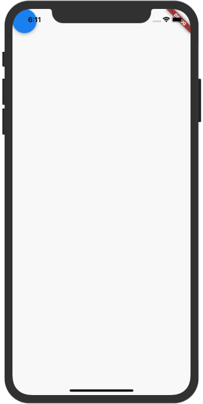
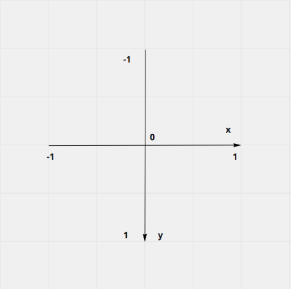
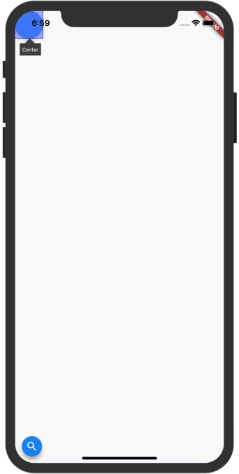
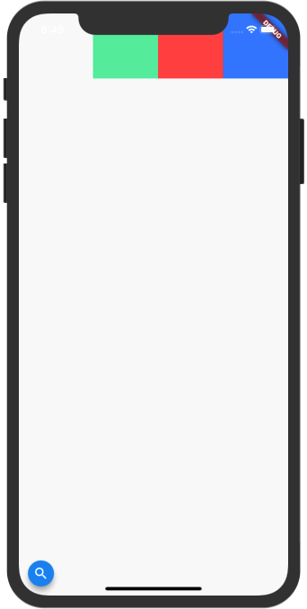
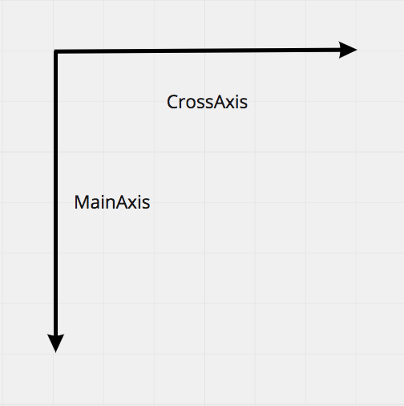
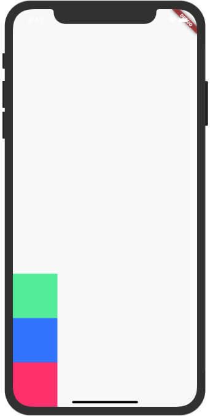
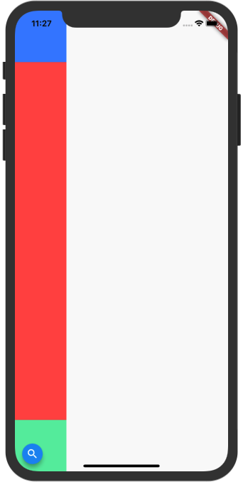
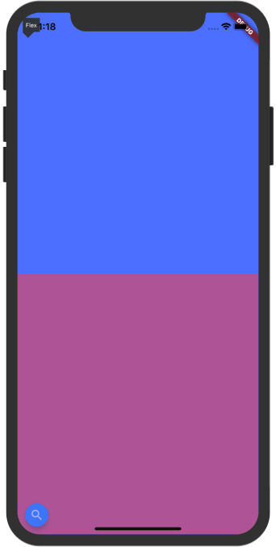
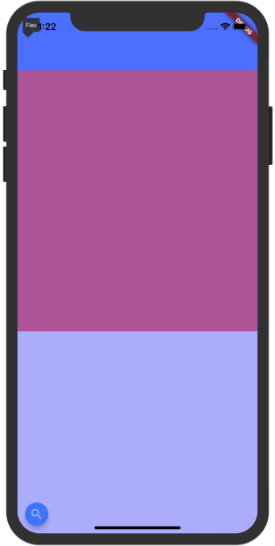
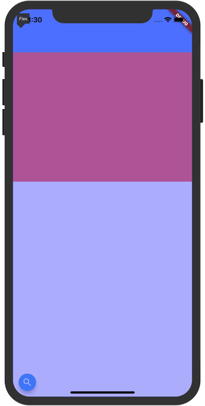

# X - Everything is Widgets 

## 前言

对于 Flutter，Google 将它定义为 一个移动 UI 工具包。跨平台只是 Flutter 基本属性的一部分，它最重要的工作，就是能够让开发者快速开发出一套精美的 UI。也许你已经听说过，在 Flutter 中 Everything is Widget，几乎所有的 UI 部分都是通过 Widget 来进行构建。为了能够为开发者提供更快的构建速度，Flutter 可以说是自带了一堆组件供开发者使用。然而当我们刚接触这个框架，常常会感到窒息，这么多 Widget 怎么学？似乎一些界面这个 Widget 做，另外的好像也可以，如何选择。深层次复杂的嵌套让人望而却步，怎样避免？以及如何来优化我们界面的性能？

实际上 Widget 有很多相通之处，当你对其中的基本组件熟悉之后，你会发现这种构建 UI 的方式非常的灵活、自由，能够让我们真正无拘无束地开发出奇妙的 UI 而不只是局限常规。任何复杂的事物都是由简单的事物堆积而成，在本章我将带领各位读者庖丁解牛地学习 Flutter 中的 Widgets，不仅会介绍重要 API，更多的结合实际场景的应用，通过这一章的学习，各位读者将能够拥有 快速上手任何 Widget 的能力。

# X.1 基本 Widget
界面可以说是和用户最近的地方，一个精美的用户界一下就会吸引用户，这也是接触 Flutter 开发最有趣的一部分。通常拿到一个设计图，作为 UI 开发者我们首先考虑的是这两个问题：屏幕上应该有什么？它们又该放在哪？布局和显示被拆分成了两个问题，让后我们分别进行解决。

对于 Flutter 来说这个问题被分解的相当彻底：一些组件只用于显示，例如按钮，文字，图片等，而另外一些组件不显示任何东西，他们的作用是对子组件进行布局，例如 行布局组件（row），列布局组件（column），单 child 对齐组件（align）。通过层级关系组成一个精美的页面。

## X.1.1 初识 Flutter

说了这么多看上去都很抽象，让我们开始第一个小 Demo 入门 Flutter 吧！首先我们创建一个新的项目，相信通过之前的学习这对你已经是小菜一碟。当你完成创建之后，我们将删除所有 main.dart 的代码内容，从零开始编写 Flutter 应用程序。

首先第一步，你需要添加最基本的 material 库的依赖，他为我们提供了完整的 material 风格的组件。

``` dart
import 'package:flutter/material.dart';
```

Flutter 具有单一函数入口，也就是经常说的 `main` 函数。那么我们现在开始

编写 main 函数。

``` dart
void mian(){
  runApp();
}
```

当你写完上面代码时，`runApp` 处会报错，没错我们现在就来处理它。`runApp` 函数从名字你很直观的能够感受到这个函数的作用就是运行一个 APP。而这里我们必须传一个 Widget。

现在问题来了，究竟什么是 Widget 呢？ 简要来说它就是我们 Flutter 中对界面的描述信息。我们先来创建第一个 Widget。

首先你需要创建一个类，我们这里把这个类叫做 App，然后让它继承至 `StatelessWidget` 类。就像这样。

``` dart
class App extends StatelessWidget{}
```

当你写完这句代码之后你的 App 类就能够创建出 Widget 了，但是没错，它的报错又多了，哈哈，我们马上就会解决它。

在 Widget 中存在着一个必须重写的 build 方法，让我们继续完成这段代码。

``` dart
class App extends StatelessWidget {
  Widget build(BuildContext context) {
    return Container();
  }
}
```

Build 方法是我们构建视图的地方，它将会返回一个 Widget，并传入一个 BuildContext 参数。现在我们暂时抛开 BuildContext 不谈，仅仅作为基本了解就好。然后在这个函数中，我们返回一个 Container ，一个最基本的 Widget。

如果你觉得这段代码手敲起来太麻烦，那么你可以使用快捷键生成。只需要在任意新行敲下 stl 然后按下回车 你的 IDE 就会自动帮你生成下面这段代码。

``` dart
class  extends StatelessWidget {
  @override
  Widget build(BuildContext context) {
    return Container();
  }
}
```

然后你只需要填写一个类名就好了。是不是非常方便呢。

好了让我们继续回到正题，现在我们已经有了一个 Widget，那么就可以将它放进 `runApp` 函数中了，整体代码如下。(为了让这个 Container 更加容易分辨，我们将其 color 属性设置为 tealAccent)

``` dart
import 'package:flutter/material.dart';

void main(){
  runApp(App());
}

class App extends StatelessWidget {
  @override
  Widget build(BuildContext context) {
    return Container(
      color: Colors.tealAccent,
    );
  }
}
```

麻雀虽小，五脏俱全，没错就是这么几行代码，你的 Flutter 应用已经完全准备好啦，现在你可以运行你的程序。当你的编译完成并安装好了之后，我们将会看到这样一个应用。


是不是比你想象中要简单很多呢，让我们继续深入吧。我们来试着向这个 Container中添加一些基本属性。现在我想要这个 Container 变成一个 高 100 dp，宽 100 dp 的小正方形，于是添加如下代码。

```dart
  Widget build(BuildContext context) {
    return Container(
      height: 100,
      width: 100,
      color: Colors.tealAccent,
    );
  }
```

然后你可以使用 '保存' 快捷键进行 hot reload。（在 Windows 上是 ctrl + s，Mac 上则是 command + s）在你的控制台应该会看到如下信息。

``` 
Performing hot reload...
Syncing files to device iPhone XR...
Reloaded 0 of 646 libraries in 69ms.
```

说明我们已经刷新成功了，但是看看你的应用，好像并没有发生任何变化，这是为什么呢。 在 Flutter 中我们使用 Widget 组合来拼接成一个页面，Flutter 就需要知道两件事：1.这个组件长什么样 2. 这个组件应该被放置在哪。

现在我们已经告诉 Flutter 我们需要在屏幕上显示一个 Container ，然而我们并没有告诉它因该显示在哪，所以这个 Container 由于自身的 约束条件被拉伸并铺满了整个屏幕。

既然我们已经知道了问题，那么该如何告诉 Flutter Container 的位置呢。在 Flutter 中 Widget 自己是不知道自己的位置的，它的位置由它的父亲节点所决定。而这时候就需要一组专门的组件用于的布局组件了。

在这个例子中，我们想要将让这个 Container 有 100 * 100 的宽高，而且居中显示。所以需要用到 Center Widget。用法很简单，在你想要让它居中的 Widget 外套一个 Center 就可以了，代码如下。

``` dart
Widget build(BuildContext context) {
    return Center(
      child: Container(
        height: 100,
        width: 100,
        color: Colors.tealAccent,
      ),
    );
  }
```

然后再使用快捷保存按钮进行 hot reload，你的应用将会快速刷新，像下面这样。


### 探索练习

Cool！你现在可以在这个方块上进行自由探索，更改它的长度/宽度/颜色，看看会有什么变化。

## X.1.2 使用 Scaffold 快速搭建页面

在上一章我们已经带大家动手做了第一个 Flutter 小程序，虽然很简单，但是已经让我们对 Flutter 有了一个初步的印象了！而现在我们要做一个相对正式的 App，还记得我们之前提到的 Google 的设计守则 Material Design 吗，为了在应用中快速的搭建起 Materila 风格的页面，Flutter 为我们提供了一个 优秀的组件 ——MaterialApp，只需要使用它就可以快速获得非常多的基础能力，可以说是必不可少的一个组件。既然谈到了 Material 设计风格，那我想要使用 Apple 的设计风格怎么办呢，同样的 Flutter 也提供了一个叫做 CupertinoApp 的 Widget 组件，你可以把它看成 MaterialApp 的 Apple 设计风格版本。但是现在我们不深入去探究它，先看看如何使用吧。

``` dart
class App extends StatelessWidget {
  @override
  Widget build(BuildContext context) {
    return MaterialApp();
  }
}
```

我们和之前一样，创建一个叫做 App 的类并继承至 Stateless Widget，在 build 方法中我们返回一个 MaterialApp。它没有任何的界面，纯粹作为功能组件使用。现在我们想要快速的 搭建起一套基础界面，就像下面这样。


这是一个非常常见的一种 Material 设计布局方式，顶部有一个导航栏，左边有一个可以点开的抽屉，下面有一个浮动按钮。为了让开发者们能够更加方便的快速搭建起这样一个布局，Flutter 为我们提供了一个 脚手架 —— Scaffold。一开始我其实也不太习惯这个名字，似乎是建筑工地修房子，就会先搭建起一个脚手架，然后就可以沿着这个架子慢慢往上修。在这里你可以把它就想像成一张纸，纸张背面已经为我们规划好了一些常见的布局位置，而我们只需要把想要的位置选出来然后把组件放上去，就可以了。听上去好像很简单，让我们来试试吧。

在我们的 MaterialApp 的 home 属性上，放置一个 Scaffold。

```dart
Widget build(BuildContext context) {
    return MaterialApp(
      home: Scaffold()
    );
  }
```

现在你的界面应该会是一片空白，现在我们要来完成第一个任务，制作一个顶部导航栏。在 Flutter 中，顶部这块蓝色的导航 我们把它称作 AppBar。在之前的一章我们曾说过，Flutter 不仅需要知道这个 Widget 长什么样。而且还需要知道 它在哪。幸运的是我们这两件事都不需要我们从零开始编写代码了，Scaffold 已经为我们规划好了 AppBar 的位置，而 AppBar 也是已经写好的组件。现在我们要做的就只是把这个 AppBar 放在 Scaffold 的 appBar 属性上。

``` dart
Widget build(BuildContext context) {
    return MaterialApp(
      home: Scaffold(
        appBar: AppBar(),
      )
    );
  }
```

是不是很简单呢，现在我们 hot reload 一下，你的界面上应该会变成这样。


同样的，我们的左部抽屉和底部的浮动按钮与AppBar 一样，Scaffold 也为它们提供了相应的位置，只需要在对应属性上放入相应对象即可。

``` dart
Widget build(BuildContext context) {
    return MaterialApp(
      home: Scaffold(
        appBar: AppBar(),
        drawer: Drawer(),
        floatingActionButton: 
        FloatingActionButton(onPressed: null),
      )
    );
  }
```


然后你就可以看到你的界面上已经具有一个顶部的 AppBar 左边有一个可以通过滑动弹出来的 Drawer，以及底部的 FloatingActionButton 了。一切都那么自然，搭建一个界面就是这么简单。

现在我们还剩最后一件事没有做，在屏幕中心我们想要显示一段文字，内容是"Hello Flutter！"。我们现在可以看到 Scaffold 的 appBar 下面有一块白色区域，这里是 Scaffold 的 body 部分，我们可以在这里进行进行自定义的布局。

在 Flutter 中显示一段文字则需要使用到 Text Widget。我们将编写下面这段代码实现此效果。

``` dart
Widget build(BuildContext context) {
    return MaterialApp(
      home: Scaffold(
        appBar: AppBar(),
        drawer: Drawer(),
        floatingActionButton: 
        FloatingActionButton(onPressed: null),
        body: Center(
          child: Text('Hello Flutter!'),
        ),
      )
    );
  }
```

使用 Text Widget 很简单，只需要向 Text Widget 的构造函数 传入一个字符串就好了。

## X.1.3 基本的单子布局组件

在上一节我们已经接触到了 Flutter 的 两个最常见的部件 MaterialApp 以及 Scaffold。你肯定已经对 Flutter 构建界面的方式有了一个初步印象了，Good。现在我们来看看 Flutter 中的布局。

你可以想一想这个问题，我们若想要在屏幕上放置一个浮动按钮，应该如何放。相信你一定会产生疑问，这个按钮应该被放在哪。现在我们来看看，若我们直接在 `Scaffold` 的 body 中放置一个 `FloatingActionButton` 会怎么样。

我们依然是按照上一节的方式，先构建基本组件 `MaterialApp` 、`Scaffold`。

``` dart
Widget build(BuildContext context) {
    return MaterialApp(
      home: Scaffold(
        body: FloatingActionButton(
          onPressed: null,
        ),
      ),
    );
  }
```



运行 app 可以看到浮动按钮出现在了左上角，在 Flutter 中，默认的定位就是在左上角，这里可以留意一下，之后我们还会遇到。

那么如何控制这个 `FloatingActionButton` 的位置呢。答案是使用 `Align` Widget！要是用 Align 我们得先回顾一下初中的知识，这是由于 Flutter 引入了基于笛卡尔坐标系（x / width）和Y /高度。



值得一提的是，看上去这个坐标系和我们之前见过的或许不太一样，它的 y 轴是竖直向下的。中心坐标为 (0,0)，中心到屏幕边缘的距离为 1。

在了解了坐标系之后相信 Align 对你来说已经能够猜到如何使用了。现在我们来使用 Align 对它的 child 进行布局吧。

``` dart
Widget build(BuildContext context) {
    return MaterialApp(
      home: Scaffold(
        body: Align(
          alignment: Alignment(0, 0),
          child: FloatingActionButton(
            onPressed: null,
          ),
        )
      ),
    );
  }
```

Align 最主要的参数就是 alignment，这个属性需要接受一个 `AlignmentGeometry` 作为参数。我们可以创建一个 Alignment 对象来对其进行描述（它是 `AlignmentGeometry` 的子类），并给它 (x , y) 坐标。我们这里给了原点坐标，现在你的 浮动按钮应该被固定在了屏幕中心了，刷新你的代码看看吧。


除了使用具体的值进行描述，我们还可以使用一些已经调整好的枚举值进行使用。

``` dart
  /// The top left corner.
  static const Alignment topLeft = Alignment(-1.0, -1.0);

  /// The center point along the top edge.
  static const Alignment topCenter = Alignment(0.0, -1.0);

  /// The top right corner.
  static const Alignment topRight = Alignment(1.0, -1.0);

  /// The center point along the left edge.
  static const Alignment centerLeft = Alignment(-1.0, 0.0);

  /// The center point, both horizontally and vertically.
  static const Alignment center = Alignment(0.0, 0.0);

  /// The center point along the right edge.
  static const Alignment centerRight = Alignment(1.0, 0.0);

  /// The bottom left corner.
  static const Alignment bottomLeft = Alignment(-1.0, 1.0);

  /// The center point along the bottom edge.
  static const Alignment bottomCenter = Alignment(0.0, 1.0);

  /// The bottom right corner.
  static const Alignment bottomRight = Alignment(1.0, 1.0);
```

要更加快速的学习一个框架，查看源码是一项非常重要的技能。我们现在看到的就是 Alignment 的源码，在这里已经定义好了很多 static 的值，相信你一定很快就能猜到，比如 topLeft 就是将其 child 按照左上方进行对齐。在代码中我们就可以这样进行使用。

``` dart
Align(
    alignment: Alignment.bottomRight,
    child: FloatingActionButton(
      onPressed: null,  
     ),
  )
```

除了这个参数以外，Align 还提供了 widthFactor 和 heightFactor 两个参数，它们又是做什么的呢。实际上当我们不设置这两个参数时，我们的 Align 默认会充满它的父级，这时候所有定位都是根据 Align 所占的空间进行的。而 widthFactor 和 heightFactor 则是用来控制 Align的大小。 而这个大小则是根据它的 child 进行调整，child 的宽高作为其因子，当 widthFactor 和 heightFactor 值为 1 时，将会和其 child 一样大小。

``` dart
Widget build(BuildContext context) {
    return MaterialApp(
      home: Scaffold(
        body: Align(
          alignment: Alignment.bottomRight,
          heightFactor: 1,
          widthFactor: 1,
          child: FloatingActionButton(
            onPressed: null,
          ),
        )
      ),
    );
  }
```

这两个参数设置为 1 会发生什么呢，我们可以通过 Flutter 官方提供的 Flutter Inspector 进行检查。大家若是使用的 Android Studio 那么这项功能会在你的 IDE 右侧有一个这样的按钮。


如果你使用的 VS Code 那么你可以使用 Dart Code ，参考下列链接 <https://dartcode.org/>。现在你需要点击下面这个按钮。


然后点击屏幕上的 Widget，你会看到在你的屏幕上出现了几根线，它们标注出了你的 Widget 的范围，即使是一些看不见的 Widget 同样也被标记出。



我们可以看到，即使我们设置了 Align 的对齐方式为 bottomRight（右下角），然而 浮动按钮还是出现在了左上角。现在我们再来看一个例子：将其  widthFactor 和 heightFactor 两个参数 都设置为 2，理论上它就会有两倍的 浮动按钮大小，然后再将其放在一个 Center （居中）小部件中。

``` dart
Widget build(BuildContext context) {
    return MaterialApp(
      home: Scaffold(
        body: Center(
          child: Align(
            alignment: Alignment.bottomRight,
            heightFactor: 2,
            widthFactor: 2,
            child: FloatingActionButton(
              onPressed: null,
            ),
          ),
        )
      ),
    );
  }
```


我们再来解释一下布局发生了什么。首先 Center 小部件充满了整个屏幕，然后把它的 child 也就是 Align 小部件居中，然后 Align 小部件有两倍的其 child 的宽度，然后根据它的对齐方式，在它的范围内进行右下角对齐。

最后我们通过源码来看 Center 小部件。

``` dart
class Center extends Align {
  const Center({ Key key, double widthFactor, double heightFactor, Widget child })
    : super(key: key, widthFactor: widthFactor, heightFactor: heightFactor, child: child);
}
```

可以看到，Center 小部件实际上就是 Align 小部件，只是无法定义其对齐属性而已。而 Align 小部件默认也是使用的居中对齐。

怎么样，现在你对 Flutter 的布局方式是不是理解的更加深刻了呢，但是光看不练很快你就会忘，赶紧试试吧。

## X.1.4 基本的布局组件 Column / Row

在上一节我们尝试了使用 `Center` `Align`  对 单个 Widget 进行布局。你是否已经掌握了呢。 在这一节中我们将会学习 Flutter 的两个最基本的多子布局控件 Column 和 Row。可以说大部分的布局都将依赖于行布局/列布局来进行实现。

要学习行/列布局，首先我们需要了解它的主轴/交叉轴。为什么要有这两根轴呢？我们来想一想，假如你有三个不同颜色的方块需要摆在屏幕上，它们分别都是 100 * 100 的宽度，你要怎么描述它的位置呢。其实初中学过直角坐标系我们都知道，要准确描述位置我们至少需要相互垂直的两根轴的数据才行。所以理解这两根轴就成了掌握 Row / Column 布局关键。

我们先从行布局入手，逐步讲解这两条轴。（Row）首先第一步还是还原代码基础部分。我们之后都会在 Scaffold 的 body 内部构件 UI。

``` dart
class App extends StatelessWidget {
  @override
  Widget build(BuildContext context) {
    return MaterialApp(
        home: Scaffold(
      		body: Row(
        		children: <Widget>[
          		Container(
            		width: 100,
            		height: 100,
            		color: Colors.blueAccent,
          		),
          		Container(
            		width: 100,
            		height: 100,
            		color: Colors.redAccent,
          		),
          		Container(
            		width: 100,
            		height: 100,
            		color: Colors.greenAccent,
          		),
        		],
      		),
    		));
  		}
		}
```

Row 的作用就是给它的所有儿子组件进行行布局，这种为多个控件进行布局的组件将会使用 children 来接收一个 Widget 的数组。在上面这个例子中我们使用了 3 个 Container 创造出了3个 不同颜色的 100 * 100 的正方形，并让它们按照行排列。刷新你的界面将会看到下面这个效果。


我们可以看到，这三个正方形从左上角开始向右依次排列，从左至右依次是按照 蓝 - 红 - 绿 这样的顺序排列，和我们源码中 children 从上至下的顺序一致。现在我们再来看 Row 的这两根轴。主轴（MainAxis）沿着水平方向从左至右，而交叉轴（CrossAxis）则是在竖直方向从上至下，见下图。


先来看主轴的对齐方式，对应的 Row 的属性 是 MainAxisAlignment。这个属性实际上是一个枚举，Row 为我们提供了下面 6 种对齐方式。

- Start：沿主轴起点开始依次对齐（默认将会使用这个属性）
- end：沿主轴终点开始依次对齐
- center：根据主轴中心对齐
- spaceBetween：沿主轴两端对齐
- spaceAround：沿主轴放置 Widget，各个 Widget 都会根据剩余空间自动计算并使用相同的间距，在第一个 Widget 和最后一个 Widget 与屏幕边缘的距离则会是 Widget 之间间距的一半。这样放置会感觉控件被均匀放置在了主轴上。
- spaceEvenly：沿主轴放置 Widget，各个 Widget 之间以及第一个和最后一个 Widget 与屏幕左右边缘之间的距离都是相等的。

文字来描述永远不如一幅图来的更加直观，我们现在来看看这些属性会给我们带来怎样的效果。由于 start 是我们的默认效果，之前的图片中已经给出，所以我们从 end 效果开始，我们添加下面这句代码（已标出）。

``` dart
Row(
  //将主轴对齐方式设置为 end  
  mainAxisAlignment: MainAxisAlignment.end,
        children: <Widget>[
         ...
        ],
      ),
```

我们 hot reload 之后可以看到这三个方块已经屏幕左边移到屏幕右边了。


然后我们再来看看 spaceAround 是什么样的效果，改变一行代码就好。

``` dart
Row(
  ...
	mainAxisAlignment: MainAxisAlignment.spaceAround,
	...
)
```


我们可以看到，各个小方块之间都有相等的间隙，而第一个小方块以及最后一个小方块之间也有（相对于 Widget 之间一半）的间隙。

看完这些例子，相信你对 Row 的主轴已经有感觉了，那么我们再来看看 Row 的交叉轴就会感觉比较简单了。

同样的，交叉轴上 Flutter 也为我们提供了 5 种对齐方式，分别是

- start：沿交叉轴的起点开始依次排列，Widget 之间紧密相连无间隙。
- end：沿交叉轴的终点开始依次排列，Widget之间紧密相连无间隙。
- center：沿交叉轴中心排列。
- stretch：强制撑满交叉轴
- baseline：沿交叉轴与基线对齐，如果主轴是垂直的，那么视其为 start。

在这里我们通过对 Row 的属性进行如下更改，将其设置为 end 效果。

``` dart
Row(
  ...
	crossAxisAlignment: CrossAxisAlignment.end,
	...
)
```

然而当你刷新屏幕之后，可能会发现和你想象中不一样。看上去并没有变化，我们任然通过 Flutter Inspector 进行检查。


我们可以看到这个 Row 在交叉轴上包裹住了它的 children，现在对他来说，不管是 start 还是 end，显示效果就都一样了，那么这种情况应该怎么处理呢。

为了让 Row 尽可能扩大并充满父组件（这里是整个屏幕），我们可以在这个 Row 组件的外部包裹一个 `SizedBox.expand` 组件。

``` dart
Widget build(BuildContext context) {
    return MaterialApp(
        home: Scaffold(
          //包裹SizedBox.expand
      body: SizedBox.expand(
        child: Row(
          crossAxisAlignment: CrossAxisAlignment.end,
          children: <Widget>[
            ...
          ],
        ),
      ),
    ));
```

然后我们刷新屏幕，这时候你应该会发现这三个 Widget 在交叉轴上都已经跑到 end 的位置了。


在 Flutter Inspector 中我们可以看到，这时候 Row 已经撑满了整个屏幕，这样在它的交叉轴上就有足够的空间进行布局了。而默认 Row 在交叉轴会使用 center 的对齐。

了解完 Row 的对齐方式，现在我们来看下一个属性 `MainAxisSize`，这个属性的作用将会决定 Row 在主轴上如何进行扩展。在之前我们可以看到，主轴上的 Widget 不需要对 Row 额外增加 SizedBox 用以扩展就直接撑满了整个主轴，原因就在于 Flutter 默认使用 MainAxisSize.max。也就是只要主轴有足够的空间就会尽可能大，直到占有所有空间。同样的 MainAxisSize 也是一个 枚举，提供了下面两种选择

- MainAxisSize.max：沿沿主轴尽可能撑满
- MainAxisSize.min：沿主轴尽可能缩小

那我们来看看 MainAxisSize.min 的效果。首先需要去掉 SizedBox.expand，然后添加该属性，代码如下：

``` dart
Widget build(BuildContext context) {
    return MaterialApp(
        home: Scaffold(
      body: Row(
        mainAxisSize: MainAxisSize.min,
        crossAxisAlignment: CrossAxisAlignment.end,
        children: <Widget>[
          Container(
            width: 100,
            height: 100,
            color: Colors.blueAccent,
          ),
          Container(
            width: 100,
            height: 100,
            color: Colors.redAccent,
          ),
          Container(
            width: 100,
            height: 100,
            color: Colors.greenAccent,
          ),
        ],
      ),
    ));
  }
```

然后我们再使用 Flutter Inspector 进行查看。


可以看到，现在的 Row 已经在主轴上尽可能小，直到刚好包裹子控件的大小。

通常我们是按照从左到右进行读写，但是有些国家是从右到左的，例如阿拉伯语。这个时候我们想要控制布局的方向的话，就需要使用到 Row 的 `textDirection` 属性了。同样地，这也是一个枚举，提供了下面两种选择

- TextDirection.ltr：从左至右(left to right)进行排列布局。（默认）
- TextDirection.rtl：从右至左(right to left)进行排列布局。

我们添加下面这段代码，来观看效果。

``` dart
Row(
  ...
	textDirection: TextDirection.rtl,
	...
)
```



这里可以回到之前的 主轴 end 对齐，来对比一下不同。三个 Widget 从左至右现在是 绿色 / 红色 / 蓝色，屏幕左右镜像颠倒了。

当我们学习过 Row 组件之后，相信 Column 组件对你来说也是小菜一碟。



在 Column 中主轴则是从上至下，交叉轴则是从左至右。同样的，它和 Row 有着如出一辙的属性

- MainAxisAlignment：主轴对齐方式
- CrossAxisAlignment：交叉轴对齐方式
- MainAxisSize：主轴扩展方式
- VerticalDirection：在竖直线上的方向，和 Row 中的 TextDirection 作用类似
- TextBaseline：基线对齐方式，很少使用

在上面的属性中，只有 VerticalDirection 没有见过。这个属性实际上和 Row 中的 TextDirection 类似，具有下面两种选择

- VerticalDirection.up：从下至上开始排列
- VerticalDirection.down：从上至下开始排列（默认）

现在我们只需要将之前的 Row 替换成 Column ，然后将其 verticalDirection 属性设置为 up。

``` dart
Widget build(BuildContext context) {
    return MaterialApp(
        home: Scaffold(
      body: Column(
        verticalDirection: VerticalDirection.up,
        children: <Widget>[
          Container(height: 100,width: 100,color: Colors.pinkAccent,),
          Container(height: 100,width: 100,color: Colors.blueAccent,),
          Container(height: 100,width: 100,color: Colors.greenAccent,),
        ],
      ),
    ));
  }
```



可以观察到，我们的代码中 children 的顺序和显示的顺序是逆反的，且从底部开始逐渐向上排列。

Cool！你已经学会了基本的布局方式了，但是你肯定还是会有些晕，各种属性对你来说印象肯定还是不深刻，最好的学习编程方式就是动手练习。现在就动手练练吧，看看你写出来的代码和想象中的样子是否一致，你会收获更多！

## Flutter 中的 Flex 布局

在上一节我们学习了 Column 和 Row 两种多 child 布局的组件，但是感觉好像还是差一点灵活性。然而这并不是 Column 和 Row 的全部，Flex 将为它们带来更加强大的灵活性。

假如你之前有过前端或者安卓的开放经验，相信 Flex 这个概念对你来说并不会陌生，例如 H5 中的 Flex Box 以及安卓中的 FlexboxLayout，它能够让我们按照比例进行布局。

在普通情况下，正常的组件是不会被拉伸的，就像上一节我们所讲到的那样，然而我们可以通过在 Flex 组件内部使用 Expanded 进行实现。

现在我们来使用 Flex 进行一个简单的布局，我们在 Flex 中还是使用三个 100 * 100 的 Container。但是我将会在第二个 Container 外部包裹一个 Expanded。

``` dart
Widget build(BuildContext context) {
    return MaterialApp(
      home: Scaffold(
          body: Flex(
        direction: Axis.vertical,
        children: <Widget>[
          Container(
            height: 100,
            width: 100,
            color: Colors.blueAccent,
          ),
          Expanded(
            child: Container(
              height: 100,
              width: 100,
              color: Colors.redAccent,
            ),
          ),
          Container(
            height: 100,
            width: 100,
            color: Colors.greenAccent,
          ),
        ],
      )),
    );
  }
```

Flex 需要传入一个必选参数 direction，这个参数将决定 Flex 究竟是横向排列它的 children 还是 竖直排列。

- Axis.vertical：竖直排列
- Axis.horizontal：水平排列

这里我选择了竖直排列，我们来看看效果。



红色的 Container 被强制拉伸撑满了整个空间，在主轴上小部件的高度被无效化。使用了 Expanded 组件的 Widget 将会变成弹性 Widget，并强制充满整个剩余空间。而 Expanded 中具有一个 弹性因子 flex。这个值 默认会是 1，当有多个具有 Expanded 包裹的组件出现在同一个 Flex Widget 中时，我们可以通过控制 Flex 来控制比例。

``` dart
  Widget build(BuildContext context) {
    return MaterialApp(
      home: Scaffold(
          body: Flex(
        direction: Axis.vertical,
        children: <Widget>[
          Expanded(
            flex: 2,
            child: Container(
              height: 100,
              width: 100,
              color: Colors.blueAccent,
            ),
          ),
          Expanded(
            child: Container(
              height: 100,
              width: 100,
              color: Colors.redAccent,
            ),
          ),
          Container(
            height: 100,
            width: 100,
            color: Colors.greenAccent,
          ),
        ],
      )),
    );
  }
```

我们给蓝色 `Container` 套上 `Expanded` 并将其 flex 因子设置为 2，第二个 只套一个 `Expanded` 不设置其 flex 因子，第三个 `Container` 保持不变，效果如下。


我们可以看到 蓝色 和 红色 的比例是 2:1，而没有套 Expanded 的部分没有变化。在主轴上我们看到使用 Expanded 能够让我们按照比例进行布局。

看到这里你或许已经发现了，Flex 和 之前的 Column / Row 很像！yes 你猜的没错，实际上 Column 和 Row 就是继承至 Flex，只不过在构造函数的时候确定了 Flex 的 direction 而已。上一节我们介绍的 Column 和 Row 的所有属性 对于 Flex 适用，这一节中的 Flex 的特性 在 Column / Row 中一样适用。

我们现在了解了 Expanded 能够强制扩展 Flex 中的 children，如果你想要更加精细的控制的话，使用 `Flexible` Widget。

这个 Widget 不仅具有 flex 因子，而且具有两种不同的方式来进行扩展，通过 fit 属性进行控制。

- Flexfit.tight（严密）：强制小部件扩展充满剩余空间
- Flexfit.loose（松散）：小部件可以按照最大进行扩展（当小部件在主轴上没有高度时），但是允许其更小。

我们来通过两个例子理解这个小部件。

``` dart
Widget build(BuildContext context) {
    return MaterialApp(
      home: Scaffold(
          body: Flex(
        direction: Axis.vertical,
        children: <Widget>[
          Flexible(
            fit: FlexFit.loose,
            child: Container(
              color: Colors.blueAccent,
            ),
          ),
          Flexible(
            fit: FlexFit.tight,
            child: Container(
              color: Colors.redAccent,
            ),
          ),
        ],
      )),
    );
  }
```

当我们的 child 小部件在主轴上没有高度时，它的作用等同于 Expanded，无论是 tight 还是 loose，它们都将会根据 flex 因子（因为没有主动设置所以默认都为1），平分整个空间。



当我们的 小部件本身在 **主轴** 上具有高度的话，那么 `FlexFit.tight` 将会无视其高度，根据 flex 因子将其强制充满剩余空间。而 `FlexFit.loose` 则会优先使用小部件本身的高度。

``` dart
Widget build(BuildContext context) {
    return MaterialApp(
      home: Scaffold(
          body: Flex(
        direction: Axis.vertical,
        children: <Widget>[
          Flexible(
            flex: 1,
            fit: FlexFit.loose,
            child: Container(
              height: 100,
              color: Colors.blueAccent,
            ),
          ),
          Flexible(
            fit: FlexFit.tight,
            child: Container(
              height: 100,
              color: Colors.redAccent,
            ),
          ),
        ],
      )),
    );
  }
```




可以看到，使用 loose 的 小部件 优先使用了其本来的高度，这里我们设置的为 100。而剩下的部分将会按照 flex 因子，为整个剩余空间的一半。这是 flex 因子为 1:1 的情况，假若其比例不同，则会影响属性为  `FlexFit.tight` 的组件。

``` dart
children: <Widget>[
          Flexible(
            flex: 2,
            fit: FlexFit.loose,
            child: Container(
              height: 100,
              color: Colors.blueAccent,
            ),
          ),
          Flexible(
            fit: FlexFit.tight,
            child: Container(
              height: 100,
              color: Colors.redAccent,
            ),
          ),
        ],
```

在这个例子中我们将第一个的 flex 因子设置为 2，第二个 flex 因子没有设置，所以默认为 1，那么现在的比例则会变成这样。



这时候，由于 flex 因子为 2:1 的缘故，所以 粉色 Container（flex 因子为1，fit 属性为 tight），在主轴上只占了 3 分之 1 的空间，而蓝色依然由于其 fit 为 loose 所以优先使用 child 的 在主轴上的长度。

实际上在进行布局的时候分为以下六个步骤；

- 首先按照不受限制的主轴约束将 children 中没有 Flex 因子（没有套 Expanded）的 Widget 进行布局。如果 [crossAxisAlignment](https://docs.flutter.io/flutter/widgets/Flex/crossAxisAlignment.html) 是 [CrossAxisAlignment.stretch](https://docs.flutter.io/flutter/rendering/CrossAxisAlignment-class.html)，则将会在 交叉轴上尽可能延伸，也就是尽可能充满父级空间。
- 按照 Flex 中存在的 flex 因子，在主轴上取最大约束，将所有剩余空间划分成 K 等份，K 就是 flex 因子加起来的值（这个例子中是 1 + 2）
- 然后将使用了 flex 因子的 child 在 交叉轴方向上根据其因子 按照比例划分剩余空间。
- 

我们可以看到，通过引入 loose 确实增加了其布局灵活性，然而同时也让整个 layout 变得更加复杂，更加难以预测。在实际的布局过程中，Expanded 是一个更佳的选择。