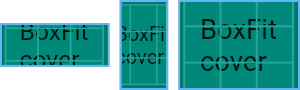
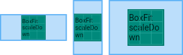
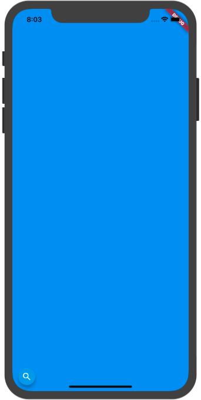
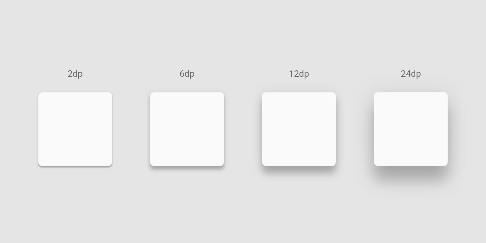
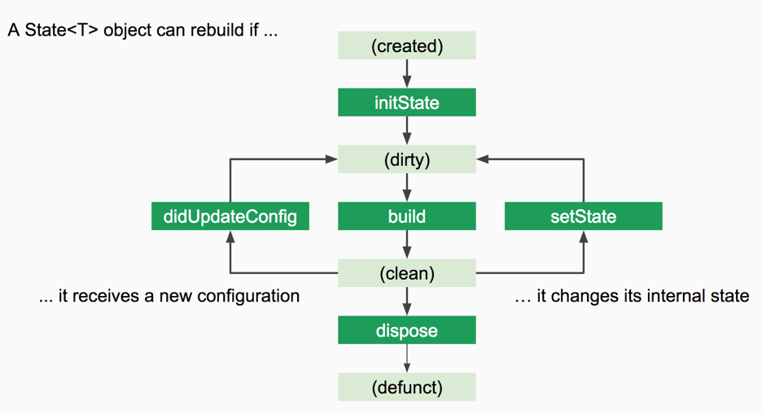
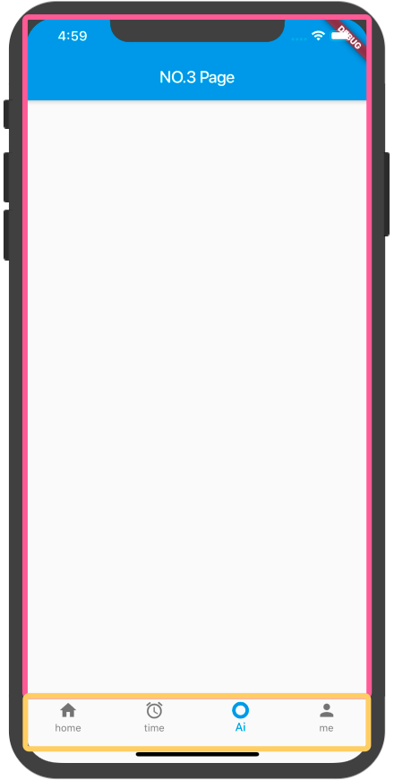

# X - Everything is Widgets 

## 前言

对于 Flutter，Google 将它定义为 一个移动 UI 工具包。跨平台只是 Flutter 基本属性的一部分，它最重要的工作，就是能够让开发者快速开发出一套精美的 UI。也许你已经听说过，在 Flutter 中 Everything is Widget，几乎所有的 UI 部分都是通过 Widget 来进行构建。为了能够为开发者提供更快的构建速度，Flutter 可以说是自带了一堆组件供开发者使用。然而当我们刚接触这个框架，常常会感到窒息，这么多 Widget 怎么学？似乎一些界面这个 Widget 做，另外的好像也可以，如何选择。深层次复杂的嵌套让人望而却步，怎样避免？以及如何来优化我们界面的性能？

实际上 Widget 有很多相通之处，当你对其中的基本组件熟悉之后，你会发现这种构建 UI 的方式非常的灵活、自由，能够让我们真正无拘无束地开发出奇妙的 UI 而不只是局限常规。任何复杂的事物都是由简单的事物堆积而成，在本章我将带领各位读者庖丁解牛地学习 Flutter 中的 Widgets，不仅会介绍重要 API，更多的结合实际场景的应用，通过这一章的学习，各位读者将能够拥有 快速上手任何 Widget 的能力。

# X.1 基础 Widget
界面可以说是和用户最近的地方，一个精美的用户界一下就会吸引用户，这也是接触 Flutter 开发最有趣的一部分。通常拿到一个设计图，作为 UI 开发者我们首先考虑的是这两个问题：屏幕上应该有什么？它们又该放在哪？布局和显示被拆分成了两个问题，让后我们分别进行解决。

对于 Flutter 来说这个问题被分解的相当彻底：一些组件只用于显示，例如按钮，文字，图片等，而另外一些组件不显示任何东西，他们的作用是对子组件进行布局，例如 行布局组件（row），列布局组件（column），单 child 对齐组件（align）。通过层级关系组成一个精美的页面。

## X.1.1 初识 Flutter

说了这么多看上去都很抽象，让我们开始第一个小 Demo 入门 Flutter 吧！首先我们创建一个新的项目，相信通过之前的学习这对你已经是小菜一碟。当你完成创建之后，我们将删除所有 main.dart 的代码内容，从零开始编写 Flutter 应用程序。

首先第一步，你需要添加最基本的 material 库的依赖，他为我们提供了完整的 material 风格的组件。

``` dart
import 'package:flutter/material.dart';
```

Flutter 具有单一函数入口，也就是经常说的 `main` 函数。那么我们现在开始

编写 main 函数。

``` dart
void mian(){
  runApp();
}
```

当你写完上面代码时，`runApp` 处会报错，没错我们现在就来处理它。`runApp` 函数从名字你很直观的能够感受到这个函数的作用就是运行一个 APP。而这里我们必须传一个 Widget。

现在问题来了，究竟什么是 Widget 呢？ 简要来说它就是我们 Flutter 中对界面的描述信息。我们先来创建第一个 Widget。

首先你需要创建一个类，我们这里把这个类叫做 App，然后让它继承至 `StatelessWidget` 类。就像这样。

``` dart
class App extends StatelessWidget{}
```

当你写完这句代码之后你的 App 类就能够创建出 Widget 了，但是没错，它的报错又多了，哈哈，我们马上就会解决它。

在 Widget 中存在着一个必须重写的 build 方法，让我们继续完成这段代码。

``` dart
class App extends StatelessWidget {
  Widget build(BuildContext context) {
    return Container();
  }
}
```

Build 方法是我们构建视图的地方，它将会返回一个 Widget，并传入一个 BuildContext 参数。现在我们暂时抛开 BuildContext 不谈，仅仅作为基本了解就好。然后在这个函数中，我们返回一个 Container ，一个最基本的 Widget。

如果你觉得这段代码手敲起来太麻烦，那么你可以使用快捷键生成。只需要在任意新行敲下 stl 然后按下回车 你的 IDE 就会自动帮你生成下面这段代码。

``` dart
class  extends StatelessWidget {
  @override
  Widget build(BuildContext context) {
    return Container();
  }
}
```

然后你只需要填写一个类名就好了。是不是非常方便呢。

好了让我们继续回到正题，现在我们已经有了一个 Widget，那么就可以将它放进 `runApp` 函数中了，整体代码如下。(为了让这个 Container 更加容易分辨，我们将其 color 属性设置为 tealAccent)

``` dart
import 'package:flutter/material.dart';

void main(){
  runApp(App());
}

class App extends StatelessWidget {
  @override
  Widget build(BuildContext context) {
    return Container(
      color: Colors.tealAccent,
    );
  }
}
```

麻雀虽小，五脏俱全，没错就是这么几行代码，你的 Flutter 应用已经完全准备好啦，现在你可以运行你的程序。当你的编译完成并安装好了之后，我们将会看到这样一个应用。


是不是比你想象中要简单很多呢，让我们继续深入吧。我们来试着向这个 Container中添加一些基本属性。现在我想要这个 Container 变成一个 高 100 dp，宽 100 dp 的小正方形，于是添加如下代码。

```dart
  Widget build(BuildContext context) {
    return Container(
      height: 100,
      width: 100,
      color: Colors.tealAccent,
    );
  }
```

然后你可以使用 '保存' 快捷键进行 hot reload。（在 Windows 上是 ctrl + s，Mac 上则是 command + s）在你的控制台应该会看到如下信息。

``` 
Performing hot reload...
Syncing files to device iPhone XR...
Reloaded 0 of 646 libraries in 69ms.
```

说明我们已经刷新成功了，但是看看你的应用，好像并没有发生任何变化，这是为什么呢。 在 Flutter 中我们使用 Widget 组合来拼接成一个页面，Flutter 就需要知道两件事：1.这个组件长什么样 2. 这个组件应该被放置在哪。

现在我们已经告诉 Flutter 我们需要在屏幕上显示一个 Container ，然而我们并没有告诉它因该显示在哪，所以这个 Container 由于自身的 约束条件被拉伸并铺满了整个屏幕。

既然我们已经知道了问题，那么该如何告诉 Flutter Container 的位置呢。在 Flutter 中 Widget 自己是不知道自己的位置的，它的位置由它的父亲节点所决定。而这时候就需要一组专门的组件用于的布局组件了。

在这个例子中，我们想要将让这个 Container 有 100 * 100 的宽高，而且居中显示。所以需要用到 Center Widget。用法很简单，在你想要让它居中的 Widget 外套一个 Center 就可以了，代码如下。

``` dart
Widget build(BuildContext context) {
    return Center(
      child: Container(
        height: 100,
        width: 100,
        color: Colors.tealAccent,
      ),
    );
  }
```

然后再使用快捷保存按钮进行 hot reload，你的应用将会快速刷新，像下面这样。


### 探索练习

Cool！你现在可以在这个方块上进行自由探索，更改它的长度/宽度/颜色，看看会有什么变化。

## X.1.2 使用 Scaffold 快速搭建页面

在上一章我们已经带大家动手做了第一个 Flutter 小程序，虽然很简单，但是已经让我们对 Flutter 有了一个初步的印象了！而现在我们要做一个相对正式的 App，还记得我们之前提到的 Google 的设计守则 Material Design 吗，为了在应用中快速的搭建起 Materila 风格的页面，Flutter 为我们提供了一个 优秀的组件 ——MaterialApp，只需要使用它就可以快速获得非常多的基础能力，可以说是必不可少的一个组件。既然谈到了 Material 设计风格，那我想要使用 Apple 的设计风格怎么办呢，同样的 Flutter 也提供了一个叫做 CupertinoApp 的 Widget 组件，你可以把它看成 MaterialApp 的 Apple 设计风格版本。但是现在我们不深入去探究它，先看看如何使用吧。

``` dart
class App extends StatelessWidget {
  @override
  Widget build(BuildContext context) {
    return MaterialApp();
  }
}
```

我们和之前一样，创建一个叫做 App 的类并继承至 Stateless Widget，在 build 方法中我们返回一个 MaterialApp。它没有任何的界面，纯粹作为功能组件使用。现在我们想要快速的 搭建起一套基础界面，就像下面这样。


这是一个非常常见的一种 Material 设计布局方式，顶部有一个导航栏，左边有一个可以点开的抽屉，下面有一个浮动按钮。为了让开发者们能够更加方便的快速搭建起这样一个布局，Flutter 为我们提供了一个 脚手架 —— Scaffold。一开始我其实也不太习惯这个名字，似乎是建筑工地修房子，就会先搭建起一个脚手架，然后就可以沿着这个架子慢慢往上修。在这里你可以把它就想像成一张纸，纸张背面已经为我们规划好了一些常见的布局位置，而我们只需要把想要的位置选出来然后把组件放上去，就可以了。听上去好像很简单，让我们来试试吧。

在我们的 MaterialApp 的 home 属性上，放置一个 Scaffold。

```dart
Widget build(BuildContext context) {
    return MaterialApp(
      home: Scaffold()
    );
  }
```

现在你的界面应该会是一片空白，现在我们要来完成第一个任务，制作一个顶部导航栏。在 Flutter 中，顶部这块蓝色的导航 我们把它称作 AppBar。在之前的一章我们曾说过，Flutter 不仅需要知道这个 Widget 长什么样。而且还需要知道 它在哪。幸运的是我们这两件事都不需要我们从零开始编写代码了，Scaffold 已经为我们规划好了 AppBar 的位置，而 AppBar 也是已经写好的组件。现在我们要做的就只是把这个 AppBar 放在 Scaffold 的 appBar 属性上。

``` dart
Widget build(BuildContext context) {
    return MaterialApp(
      home: Scaffold(
        appBar: AppBar(),
      )
    );
  }
```

是不是很简单呢，现在我们 hot reload 一下，你的界面上应该会变成这样。


同样的，我们的左部抽屉和底部的浮动按钮与AppBar 一样，Scaffold 也为它们提供了相应的位置，只需要在对应属性上放入相应对象即可。

``` dart
Widget build(BuildContext context) {
    return MaterialApp(
      home: Scaffold(
        appBar: AppBar(),
        drawer: Drawer(),
        floatingActionButton: 
        FloatingActionButton(onPressed: null),
      )
    );
  }
```


然后你就可以看到你的界面上已经具有一个顶部的 AppBar 左边有一个可以通过滑动弹出来的 Drawer，以及底部的 FloatingActionButton 了。一切都那么自然，搭建一个界面就是这么简单。

现在我们还剩最后一件事没有做，在屏幕中心我们想要显示一段文字，内容是"Hello Flutter！"。我们现在可以看到 Scaffold 的 appBar 下面有一块白色区域，这里是 Scaffold 的 body 部分，我们可以在这里进行进行自定义的布局。

在 Flutter 中显示一段文字则需要使用到 Text Widget。我们将编写下面这段代码实现此效果。

``` dart
Widget build(BuildContext context) {
    return MaterialApp(
      home: Scaffold(
        appBar: AppBar(),
        drawer: Drawer(),
        floatingActionButton: 
        FloatingActionButton(onPressed: null),
        body: Center(
          child: Text('Hello Flutter!'),
        ),
      )
    );
  }
```

使用 Text Widget 很简单，只需要向 Text Widget 的构造函数 传入一个字符串就好了。

## X.1.3 基本的单子布局组件 Align / Center

在上一节我们已经接触到了 Flutter 的 两个最常见的部件 MaterialApp 以及 Scaffold。你肯定已经对 Flutter 构建界面的方式有了一个初步印象了，Good。现在我们来看看 Flutter 中的布局。

你可以想一想这个问题，我们若想要在屏幕上放置一个浮动按钮，应该如何放。相信你一定会产生疑问，这个按钮应该被放在哪。现在我们来看看，若我们直接在 `Scaffold` 的 body 中放置一个 `FloatingActionButton` 会怎么样。

我们依然是按照上一节的方式，先构建基本组件 `MaterialApp` 、`Scaffold`。

``` dart
Widget build(BuildContext context) {
    return MaterialApp(
      home: Scaffold(
        body: FloatingActionButton(
          onPressed: null,
        ),
      ),
    );
  }
```


运行 app 可以看到浮动按钮出现在了左上角，在 Flutter 中，默认的定位就是在左上角，这里可以留意一下，之后我们还会遇到。

那么如何控制这个 `FloatingActionButton` 的位置呢。答案是使用 `Align` Widget！要是用 Align 我们得先回顾一下初中的知识，这是由于 Flutter 引入了基于笛卡尔坐标系（x / width）和Y /高度。


值得一提的是，看上去这个坐标系和我们之前见过的或许不太一样，它的 y 轴是竖直向下的。中心坐标为 (0,0)，中心到屏幕边缘的距离为 1。

在了解了坐标系之后相信 Align 对你来说已经能够猜到如何使用了。现在我们来使用 Align 对它的 child 进行布局吧。

``` dart
Widget build(BuildContext context) {
    return MaterialApp(
      home: Scaffold(
        body: Align(
          alignment: Alignment(0, 0),
          child: FloatingActionButton(
            onPressed: null,
          ),
        )
      ),
    );
  }
```

Align 最主要的参数就是 alignment，这个属性需要接受一个 `AlignmentGeometry` 作为参数。我们可以创建一个 Alignment 对象来对其进行描述（它是 `AlignmentGeometry` 的子类），并给它 (x , y) 坐标。我们这里给了原点坐标，现在你的 浮动按钮应该被固定在了屏幕中心了，刷新你的代码看看吧。


除了使用具体的值进行描述，我们还可以使用一些已经调整好的枚举值进行使用。

``` dart
  /// The top left corner.
  static const Alignment topLeft = Alignment(-1.0, -1.0);

  /// The center point along the top edge.
  static const Alignment topCenter = Alignment(0.0, -1.0);

  /// The top right corner.
  static const Alignment topRight = Alignment(1.0, -1.0);

  /// The center point along the left edge.
  static const Alignment centerLeft = Alignment(-1.0, 0.0);

  /// The center point, both horizontally and vertically.
  static const Alignment center = Alignment(0.0, 0.0);

  /// The center point along the right edge.
  static const Alignment centerRight = Alignment(1.0, 0.0);

  /// The bottom left corner.
  static const Alignment bottomLeft = Alignment(-1.0, 1.0);

  /// The center point along the bottom edge.
  static const Alignment bottomCenter = Alignment(0.0, 1.0);

  /// The bottom right corner.
  static const Alignment bottomRight = Alignment(1.0, 1.0);
```

要更加快速的学习一个框架，查看源码是一项非常重要的技能。我们现在看到的就是 Alignment 的源码，在这里已经定义好了很多 static 的值，相信你一定很快就能猜到，比如 topLeft 就是将其 child 按照左上方进行对齐。在代码中我们就可以这样进行使用。

``` dart
Align(
    alignment: Alignment.bottomRight,
    child: FloatingActionButton(
      onPressed: null,  
     ),
  )
```

除了这个参数以外，Align 还提供了 widthFactor 和 heightFactor 两个参数，它们又是做什么的呢。实际上当我们不设置这两个参数时，我们的 Align 默认会充满它的父级，这时候所有定位都是根据 Align 所占的空间进行的。而 widthFactor 和 heightFactor 则是用来控制 Align的大小。 而这个大小则是根据它的 child 进行调整，child 的宽高作为其因子，当 widthFactor 和 heightFactor 值为 1 时，将会和其 child 一样大小。

``` dart
Widget build(BuildContext context) {
    return MaterialApp(
      home: Scaffold(
        body: Align(
          alignment: Alignment.bottomRight,
          heightFactor: 1,
          widthFactor: 1,
          child: FloatingActionButton(
            onPressed: null,
          ),
        )
      ),
    );
  }
```

这两个参数设置为 1 会发生什么呢，我们可以通过 Flutter 官方提供的 Flutter Inspector 进行检查。大家若是使用的 Android Studio 那么这项功能会在你的 IDE 右侧有一个这样的按钮。


如果你使用的 VS Code 那么你可以使用 Dart Code ，参考下列链接 <https://dartcode.org/>。现在你需要点击下面这个按钮。


然后点击屏幕上的 Widget，你会看到在你的屏幕上出现了几根线，它们标注出了你的 Widget 的范围，即使是一些看不见的 Widget 同样也被标记出。


我们可以看到，即使我们设置了 Align 的对齐方式为 bottomRight（右下角），然而 浮动按钮还是出现在了左上角。现在我们再来看一个例子：将其  widthFactor 和 heightFactor 两个参数 都设置为 2，理论上它就会有两倍的 浮动按钮大小，然后再将其放在一个 Center （居中）小部件中。

``` dart
Widget build(BuildContext context) {
    return MaterialApp(
      home: Scaffold(
        body: Center(
          child: Align(
            alignment: Alignment.bottomRight,
            heightFactor: 2,
            widthFactor: 2,
            child: FloatingActionButton(
              onPressed: null,
            ),
          ),
        )
      ),
    );
  }
```


我们再来解释一下布局发生了什么。首先 Center 小部件充满了整个屏幕，然后把它的 child 也就是 Align 小部件居中，然后 Align 小部件有两倍的其 child 的宽度，然后根据它的对齐方式，在它的范围内进行右下角对齐。

最后我们通过源码来看 Center 小部件。

``` dart
class Center extends Align {
  const Center({ Key key, double widthFactor, double heightFactor, Widget child })
    : super(key: key, widthFactor: widthFactor, heightFactor: heightFactor, child: child);
}
```

可以看到，Center 小部件实际上就是 Align 小部件，只是无法定义其对齐属性而已。而 Align 小部件默认也是使用的居中对齐。

怎么样，现在你对 Flutter 的布局方式是不是理解的更加深刻了呢，但是光看不练很快你就会忘，赶紧试试吧。

## X.1.4 基本的多子布局组件 Column / Row

在上一节我们尝试了使用 `Center` `Align`  对 单个 Widget 进行布局。你是否已经掌握了呢。 在这一节中我们将会学习 Flutter 的两个最基本的多子布局控件 Column 和 Row。可以说大部分的布局都将依赖于行布局/列布局来进行实现。

要学习行/列布局，首先我们需要了解它的主轴/横轴。为什么要有这两根轴呢？我们来想一想，假如你有三个不同颜色的方块需要摆在屏幕上，它们分别都是 100 * 100 的宽度，你要怎么描述它的位置呢。其实初中学过直角坐标系我们都知道，要准确描述位置我们至少需要相互垂直的两根轴的数据才行。所以理解这两根轴就成了掌握 Row / Column 布局关键。

我们先从行布局入手，逐步讲解这两条轴。（Row）首先第一步还是还原代码基础部分。我们之后都会在 Scaffold 的 body 内部构件 UI。

``` dart
class App extends StatelessWidget {
  @override
  Widget build(BuildContext context) {
    return MaterialApp(
        home: Scaffold(
      		body: Row(
        		children: <Widget>[
          		Container(
            		width: 100,
            		height: 100,
            		color: Colors.blueAccent,
          		),
          		Container(
            		width: 100,
            		height: 100,
            		color: Colors.redAccent,
          		),
          		Container(
            		width: 100,
            		height: 100,
            		color: Colors.greenAccent,
          		),
        		],
      		),
    		));
  		}
		}
```

Row 的作用就是给它的所有儿子组件进行行布局，这种为多个控件进行布局的组件将会使用 children 来接收一个 Widget 的数组。在上面这个例子中我们使用了 3 个 Container 创造出了3个 不同颜色的 100 * 100 的正方形，并让它们按照行排列。刷新你的界面将会看到下面这个效果。


我们可以看到，这三个正方形从左上角开始向右依次排列，从左至右依次是按照 蓝 - 红 - 绿 这样的顺序排列，和我们源码中 children 从上至下的顺序一致。现在我们再来看 Row 的这两根轴。主轴（MainAxis）沿着水平方向从左至右，而横轴（CrossAxis）则是在竖直方向从上至下，见下图。


先来看主轴的对齐方式，对应的 Row 的属性 是 MainAxisAlignment。这个属性实际上是一个枚举，Row 为我们提供了下面 6 种对齐方式。

- Start：沿主轴起点开始依次对齐（默认将会使用这个属性）
- end：沿主轴终点开始依次对齐
- center：根据主轴中心对齐
- spaceBetween：沿主轴两端对齐
- spaceAround：沿主轴放置 Widget，各个 Widget 都会根据剩余空间自动计算并使用相同的间距，在第一个 Widget 和最后一个 Widget 与屏幕边缘的距离则会是 Widget 之间间距的一半。这样放置会感觉控件被均匀放置在了主轴上。
- spaceEvenly：沿主轴放置 Widget，各个 Widget 之间以及第一个和最后一个 Widget 与屏幕左右边缘之间的距离都是相等的。

文字来描述永远不如一幅图来的更加直观，我们现在来看看这些属性会给我们带来怎样的效果。由于 start 是我们的默认效果，之前的图片中已经给出，所以我们从 end 效果开始，我们添加下面这句代码（已标出）。

``` dart
Row(
  //将主轴对齐方式设置为 end  
  mainAxisAlignment: MainAxisAlignment.end,
        children: <Widget>[
         ...
        ],
      ),
```

我们 hot reload 之后可以看到这三个方块已经屏幕左边移到屏幕右边了。


然后我们再来看看 spaceAround 是什么样的效果，改变一行代码就好。

``` dart
Row(
  ...
	mainAxisAlignment: MainAxisAlignment.spaceAround,
	...
)
```


我们可以看到，各个小方块之间都有相等的间隙，而第一个小方块以及最后一个小方块之间也有（相对于 Widget 之间一半）的间隙。

看完这些例子，相信你对 Row 的主轴已经有感觉了，那么我们再来看看 Row 的横轴就会感觉比较简单了。

同样的，横轴上 Flutter 也为我们提供了 5 种对齐方式，分别是

- start：沿横轴的起点开始依次排列，Widget 之间紧密相连无间隙。
- end：沿横轴的终点开始依次排列，Widget之间紧密相连无间隙。
- center：沿横轴中心排列。
- stretch：强制撑满横轴
- baseline：沿横轴与基线对齐，如果主轴是垂直的，那么视其为 start。

在这里我们通过对 Row 的属性进行如下更改，将其设置为 end 效果。

``` dart
Row(
  ...
	crossAxisAlignment: CrossAxisAlignment.end,
	...
)
```

然而当你刷新屏幕之后，可能会发现和你想象中不一样。看上去并没有变化，我们任然通过 Flutter Inspector 进行检查。


我们可以看到这个 Row 在横轴上包裹住了它的 children，现在对他来说，不管是 start 还是 end，显示效果就都一样了，那么这种情况应该怎么处理呢。

为了让 Row 尽可能扩大并充满父组件（这里是整个屏幕），我们可以在这个 Row 组件的外部包裹一个 `SizedBox.expand` 组件。

``` dart
Widget build(BuildContext context) {
    return MaterialApp(
        home: Scaffold(
          //包裹SizedBox.expand
      body: SizedBox.expand(
        child: Row(
          crossAxisAlignment: CrossAxisAlignment.end,
          children: <Widget>[
            ...
          ],
        ),
      ),
    ));
```

然后我们刷新屏幕，这时候你应该会发现这三个 Widget 在横轴上都已经跑到 end 的位置了。


在 Flutter Inspector 中我们可以看到，这时候 Row 已经撑满了整个屏幕，这样在它的横轴上就有足够的空间进行布局了。而默认 Row 在横轴会使用 center 的对齐。

了解完 Row 的对齐方式，现在我们来看下一个属性 `MainAxisSize`，这个属性的作用将会决定 Row 在主轴上如何进行扩展。在之前我们可以看到，主轴上的 Widget 不需要对 Row 额外增加 SizedBox 用以扩展就直接撑满了整个主轴，原因就在于 Flutter 默认使用 MainAxisSize.max。也就是只要主轴有足够的空间就会尽可能大，直到占有所有空间。同样的 MainAxisSize 也是一个 枚举，提供了下面两种选择

- MainAxisSize.max：沿沿主轴尽可能撑满
- MainAxisSize.min：沿主轴尽可能缩小

那我们来看看 MainAxisSize.min 的效果。首先需要去掉 SizedBox.expand，然后添加该属性，代码如下：

``` dart
Widget build(BuildContext context) {
    return MaterialApp(
        home: Scaffold(
      body: Row(
        mainAxisSize: MainAxisSize.min,
        crossAxisAlignment: CrossAxisAlignment.end,
        children: <Widget>[
          Container(
            width: 100,
            height: 100,
            color: Colors.blueAccent,
          ),
          Container(
            width: 100,
            height: 100,
            color: Colors.redAccent,
          ),
          Container(
            width: 100,
            height: 100,
            color: Colors.greenAccent,
          ),
        ],
      ),
    ));
  }
```

然后我们再使用 Flutter Inspector 进行查看。


可以看到，现在的 Row 已经在主轴上尽可能小，直到刚好包裹子控件的大小。

通常我们是按照从左到右进行读写，但是有些国家是从右到左的，例如阿拉伯语。这个时候我们想要控制布局的方向的话，就需要使用到 Row 的 `textDirection` 属性了。同样地，这也是一个枚举，提供了下面两种选择

- TextDirection.ltr：从左至右(left to right)进行排列布局。（默认）
- TextDirection.rtl：从右至左(right to left)进行排列布局。

我们添加下面这段代码，来观看效果。

``` dart
Row(
  ...
	textDirection: TextDirection.rtl,
	...
)
```


这里可以回到之前的 主轴 end 对齐，来对比一下不同。三个 Widget 从左至右现在是 绿色 / 红色 / 蓝色，屏幕左右镜像颠倒了。

当我们学习过 Row 组件之后，相信 Column 组件对你来说也是小菜一碟。


在 Column 中主轴则是从上至下，横轴则是从左至右。同样的，它和 Row 有着如出一辙的属性

- MainAxisAlignment：主轴对齐方式
- CrossAxisAlignment：横轴对齐方式
- MainAxisSize：主轴扩展方式
- VerticalDirection：在竖直线上的方向，和 Row 中的 TextDirection 作用类似
- TextBaseline：基线对齐方式，很少使用

在上面的属性中，只有 VerticalDirection 没有见过。这个属性实际上和 Row 中的 TextDirection 类似，具有下面两种选择

- VerticalDirection.up：从下至上开始排列
- VerticalDirection.down：从上至下开始排列（默认）

现在我们只需要将之前的 Row 替换成 Column ，然后将其 verticalDirection 属性设置为 up。

``` dart
Widget build(BuildContext context) {
    return MaterialApp(
        home: Scaffold(
      body: Column(
        verticalDirection: VerticalDirection.up,
        children: <Widget>[
          Container(height: 100,width: 100,color: Colors.pinkAccent,),
          Container(height: 100,width: 100,color: Colors.blueAccent,),
          Container(height: 100,width: 100,color: Colors.greenAccent,),
        ],
      ),
    ));
  }
```


可以观察到，我们的代码中 children 的顺序和显示的顺序是逆反的，且从底部开始逐渐向上排列。

小提示：想要判断哪根轴是主轴，哪根轴是横轴其实很简单。它能够进行延展摆放其 child 的方向就是主轴，与其垂直的就是横轴。这样就很好记忆啦。

Cool！你已经学会了基本的布局方式了，但是你肯定还是会有些晕，各种属性对你来说印象肯定还是不深刻，最好的学习编程方式就是动手练习。现在就动手练练吧，看看你写出来的代码和想象中的样子是否一致，你会收获更多！

## X.1.5 Flutter 中的 Flex 布局 Expanded / Flexible

在上一节我们学习了 Column 和 Row 两种多 child 布局的组件，但是感觉好像还是差一点灵活性。然而这并不是 Column 和 Row 的全部，Flex 将为它们带来更加强大的灵活性。

假如你之前有过前端或者安卓的开放经验，相信 Flex 这个概念对你来说并不会陌生，例如 H5 中的 Flex Box 以及安卓中的 FlexboxLayout，它能够让我们按照比例进行布局。

在普通情况下，正常的组件是不会被拉伸的，就像上一节我们所讲到的那样，然而我们可以通过在 Flex 组件内部使用 Expanded 进行实现。

现在我们来使用 Flex 进行一个简单的布局，我们在 Flex 中还是使用三个 100 * 100 的 Container。但是我将会在第二个 Container 外部包裹一个 Expanded。

``` dart
Widget build(BuildContext context) {
    return MaterialApp(
      home: Scaffold(
          body: Flex(
        direction: Axis.vertical,
        children: <Widget>[
          Container(
            height: 100,
            width: 100,
            color: Colors.blueAccent,
          ),
          Expanded(
            child: Container(
              height: 100,
              width: 100,
              color: Colors.redAccent,
            ),
          ),
          Container(
            height: 100,
            width: 100,
            color: Colors.greenAccent,
          ),
        ],
      )),
    );
  }
```

Flex 需要传入一个必选参数 direction，这个参数将决定 Flex 究竟是横向排列它的 children 还是 竖直排列。

- Axis.vertical：竖直排列
- Axis.horizontal：水平排列

这里我选择了竖直排列，我们来看看效果。


红色的 Container 被强制拉伸撑满了整个空间，在主轴上小部件的高度被无效化。使用了 Expanded 组件的 Widget 将会变成弹性 Widget，并强制充满整个剩余空间。而 Expanded 中具有一个 弹性因子 flex。这个值 默认会是 1，当有多个具有 Expanded 包裹的组件出现在同一个 Flex Widget 中时，我们可以通过控制 Flex 来控制比例。

``` dart
  Widget build(BuildContext context) {
    return MaterialApp(
      home: Scaffold(
          body: Flex(
        direction: Axis.vertical,
        children: <Widget>[
          Expanded(
            flex: 2,
            child: Container(
              height: 100,
              width: 100,
              color: Colors.blueAccent,
            ),
          ),
          Expanded(
            child: Container(
              height: 100,
              width: 100,
              color: Colors.redAccent,
            ),
          ),
          Container(
            height: 100,
            width: 100,
            color: Colors.greenAccent,
          ),
        ],
      )),
    );
  }
```

我们给蓝色 `Container` 套上 `Expanded` 并将其 flex 因子设置为 2，第二个 只套一个 `Expanded` 不设置其 flex 因子，第三个 `Container` 保持不变，效果如下。


我们可以看到 蓝色 和 红色 的比例是 2:1，而没有套 Expanded 的部分没有变化。在主轴上我们看到使用 Expanded 能够让我们按照比例进行布局。

看到这里你或许已经发现了，Flex 和 之前的 Column / Row 很像！yes 你猜的没错，实际上 Column 和 Row 就是继承至 Flex，只不过在构造函数的时候确定了 Flex 的 direction 而已。上一节我们介绍的 Column 和 Row 的所有属性 对于 Flex 适用，这一节中的 Flex 的特性 在 Column / Row 中一样适用。

我们现在了解了 Expanded 能够强制扩展 Flex 中的 children，如果你想要更加精细的控制的话，使用 `Flexible` Widget。

这个 Widget 不仅具有 flex 因子，而且具有两种不同的方式来进行扩展，通过 fit 属性进行控制。

- Flexfit.tight（严密）：强制小部件扩展充满剩余空间（Expanded 实际上就是使用了该属性的 Flexible 的包装）
- Flexfit.loose（松散）：小部件可以按照最大进行扩展（当小部件在主轴上没有高度时），但是允许其更小。

我们来通过两个例子理解这个小部件。

``` dart
Widget build(BuildContext context) {
    return MaterialApp(
      home: Scaffold(
          body: Flex(
        direction: Axis.vertical,
        children: <Widget>[
          Flexible(
            fit: FlexFit.loose,
            child: Container(
              color: Colors.blueAccent,
            ),
          ),
          Flexible(
            fit: FlexFit.tight,
            child: Container(
              color: Colors.redAccent,
            ),
          ),
        ],
      )),
    );
  }
```

当我们的 child 小部件在主轴上没有高度时，它的作用等同于 Expanded，无论是 tight 还是 loose，它们都将会根据 flex 因子（因为没有主动设置所以默认都为1），平分整个空间。


当我们的 小部件本身在 **主轴** 上具有高度的话，那么 `FlexFit.tight` 将会无视其高度，根据 flex 因子将其强制充满剩余空间。而 `FlexFit.loose` 则会优先使用小部件本身的高度。

``` dart
Widget build(BuildContext context) {
    return MaterialApp(
      home: Scaffold(
          body: Flex(
        direction: Axis.vertical,
        children: <Widget>[
          Flexible(
            flex: 1,
            fit: FlexFit.loose,
            child: Container(
              height: 100,
              color: Colors.blueAccent,
            ),
          ),
          Flexible(
            fit: FlexFit.tight,
            child: Container(
              height: 100,
              color: Colors.redAccent,
            ),
          ),
        ],
      )),
    );
  }
```


可以看到，使用 loose 的 小部件 优先使用了其本来的高度，这里我们设置的为 100。而剩下的部分将会按照 flex 因子，为整个剩余空间的一半。这是 flex 因子为 1:1 的情况，假若其比例不同，则会影响属性为  `FlexFit.tight` 的组件。

``` dart
children: <Widget>[
          Flexible(
            flex: 2,
            fit: FlexFit.loose,
            child: Container(
              height: 100,
              color: Colors.blueAccent,
            ),
          ),
          Flexible(
            fit: FlexFit.tight,
            child: Container(
              height: 100,
              color: Colors.redAccent,
            ),
          ),
        ],
```

在这个例子中我们将第一个的 flex 因子设置为 2，第二个 flex 因子没有设置，所以默认为 1，那么现在的比例则会变成这样。


这时候，由于 flex 因子为 2:1 的缘故，所以 粉色 Container（flex 因子为1，fit 属性为 tight），在主轴上只占了 3 分之 1 的空间，而蓝色依然由于其 fit 为 loose 所以优先使用 child 的 在主轴上的长度。

实际上在进行布局的时候分为以下六个步骤；

- 首先按照不受限制的主轴约束将 children 中没有 Flex 因子（没有套 Expanded）的 Widget 进行布局。如果 [crossAxisAlignment](https://docs.flutter.io/flutter/widgets/Flex/crossAxisAlignment.html) 是 [CrossAxisAlignment.stretch](https://docs.flutter.io/flutter/rendering/CrossAxisAlignment-class.html)，则将会在 横轴上尽可能延伸，也就是尽可能充满父级空间。
- 然后按照 Flex 中存在的 flex 因子，将所有剩余空间划分成 K 等份，K 就是 flex 因子加起来的值（这个例子中是 1 + 2）然后将使用了 flex 因子的 child 在 横轴方向上根据其因子 按照比例划分剩余空间。
- 像步骤 1 那样 对那些剩下的有相同 横轴约束的 children 进行布局，但是在主轴上将根据步骤 2 中分配的空间使用 max 约束，而不是使用 无边界 的主轴约束。（也就是是说在 2 划分的范围内，主轴尽可能大）当使用了 Flexible.tight 的 child 将会强制拉伸到其的 flex 因子所占空间大小（紧约束：Flexible.tight / Expanded 都会让它的 child 进行强制拉伸，无视其自身的高度）而使用了 Flexible.loose 的属性将会优先使用其自身的高度，若 child 本身没有高度，那么则会按照 flex 因子进行拉伸。（松散约束：Flexible.loose 包裹的 child 具有此种约束）
- Flex 的横轴约束将使用 child 的横轴能达到的最大值，它将满足传入的约束。（也就是说child Widget 在横轴为设置长度那么就会被强制拉伸，假若有长度那么就会使用其长度）
- Flex 在主轴上按照 主轴大小（mainAxisSize）属性决定其长度，如果 mainAxisSize 为 max，那么 Flex 主轴范围将会尽可能大。如果是 min 那么 Flex 将会包裹子节点。
- 根据 mainAxisAlignment 和 crossAxisAlignment 确定每个 child 的位置。（也就是我们上一节所提到的，start、end、spaceBetween…)

你并不需要将这个流程整个记下来，它仅仅是让你能够更加深刻的理解 Flex 的布局行为而已。简单来说，它是按照 计算非 flex 控件大小 -> 计算 flex 控件大小 -> 计算位置 这样的过程完成了整个布局行为。

我们可以看到，通过引入 loose 确实增加了其布局灵活性，然而同时也让整个 layout 变得更加复杂，更加难以预测。在实际的布局过程中，Expanded 是一个更佳的选择。我们会在之后的练习中不断使用到 Flex 布局，之后可以在实战练习中细细体会。

**试一试**：尝试使用多个组件，直到整个屏幕无法装下 Row / Column 中的组件为止。

```dart
Widget build(BuildContext context) {
    return Scaffold(
      body: Column(children: <Widget>[
        Container(height: 300,color: Colors.blueAccent,),
        Container(height: 300,color: Colors.redAccent,),
        Container(height: 300,color: Colors.yellowAccent,),
      ],)
    );
  }
```


我们可以看到在 Column 的主轴尾部出现了一个警告区域，提示我们 bottom overflowed by 4.0 pixels。这是我们一定要避免的情况，我们不应该让其 children 比它能够承受的最宽限度还要大，我们通常可以使用 flex 布局来避免出现此类情况。如果你想要进行滑动，Flutter 提供了可滑动系列组件来专门处理滑动的情况。

但是有时候我们仅仅只是为了保证 Flex 不出现此类情况。例如登陆页面，有些手机很长有些很短，屏幕比例各不相同，这就对我们的适配带来了问题。Flutter 为这种情况专门提供了一个 SingleChildScrollView Widget 进行处理。

``` dart
Widget build(BuildContext context) {
    return Scaffold(
      body: SingleChildScrollView(
        child: Column(children: <Widget>[
          Container(height: 300,color: Colors.blueAccent,),
          Container(height: 300,color: Colors.redAccent,),
          Container(height: 300,color: Colors.yellowAccent,),
        ],),
      )
    );
  }
```

现在我们可以让超出范围的 Column 变得可以滑动，前提是 SingleChildScrollView 的滚动方向 scrollDirection 必须与超出范围的方向一致，在这里我们默认是水平滑动。

另外需要注意的是，使用 SingleChildScrollView 代价很高，它不具有 Sliver 的 自动回收/懒加载特性，超出屏幕的部分也参与了布局及渲染计算，大量使用会降低性能，请谨慎使用。

## X.1.6 基本边距小部件 Padding

我们在前面已经介绍了一些常用的布局小部件，除了这些布局以外，在开发过程中还会有一个使用频率非常高的小部件 `Padding` 这个小部件能够在 它的 child 外创造出一段 space 进行填充。我们还是来看一段代码理解一下。

``` dart
Widget build(BuildContext context) {
    return MaterialApp(
      home: Scaffold(
          body: Padding(
        padding: const EdgeInsets.all(8.0),
        child: Container(
          color: Colors.blueAccent,
        ),
      )),
    );
  }
```

我们在屏幕上有一个 蓝色的 `Container`，由于我们们并没有给它设置位置，那么他会尽可能扩展自己，并充满屏幕。然后现在我们给它一个 `Padding` 并在所有边上填充一个 8 dp 的边距，现在整个屏幕会是这样。


实际上 `Padding` Widget 只关心一个参数，也就是 padding，它是一个 `EdgeInsetsGeometry` 实例。`EdgeInsetsGeometry` 是抽象类，也是 `EdgeInsets` 的基类。

通常我们会使用  `EdgeInsets` 设置边距。

- EdgeInsets.fromLTRB：分别设置 左端、顶端、右端、底端的边距
- EdgeInsets.all：设置全边距
- EdgeInsets.only：设置任意边的边距
- EdgeInsets.symmetric：设置水平（horizontal）边距或垂直（vertical）边距

这些属性都很好理解，我们就不一一展示了，需要注意的是这些创建 `EdgeInsets` 的方法都是 `const` 的。在之前的 Dart 语法中我们学习到，`const` 定义的变量是编译时常量，必须在编译时就已经确定。所以这里就不能够传入某一个变量，只能是确切的数字。

除了 `EdgeInsets`,我们还可以使用 `EdgeInsetsDirectional` ，它与  `EdgeInsets` 不同的是它还与方向相关。还记得我们上一节提到的 `Column` / `Row` 都存在一个方向属性吗，`EdgeInsetsDirectional` 会根据其方向调整填充的边。同样的它也具有 `start`、`end`、`top`、`bottom` 四个属性。我们来看一个例子。

``` dart
Widget build(BuildContext context) {
    return Scaffold(
      body: Directionality(
        textDirection: TextDirection.ltr,
        child: Padding(
          padding: EdgeInsetsDirectional.only(start: 100),
          child: Container(
            color: Colors.blueAccent,
          ),
        ),
      ),
    );
  }
```

这里我们让其 textDirection 设置为默认的 ltr （left to right）效果如下。


在 start 处增加了一个 100 dp 的 padding，然而当我们将 textDirection 切换到 rtl（right to left）时将会是这样。


verticalDirection 同理，会在竖直方向上根据其方向进行填充。不过这个属性用的很少，更多的还是使用 `EdgeInsets`。

除了这些常规能够进行自定义边距的类之外，Flutter 还为特殊情况预设了一些 EdgeInsets。

我们都知道现在手机屏幕不再是简单的长方形了，异形屏、挖孔屏等等我们都需要对其进行适配。通过 MediaQuery 我们能够获取到手机的这些信息。

``` dart
Widget build(BuildContext context) {
    return Scaffold(
      body: Directionality(
        textDirection: TextDirection.rtl,
        child: Padding(
          padding: MediaQuery.of(context).padding,
          child: Container(
            color: Colors.blueAccent,
          ),
        ),
      ),
    );
  }
```

我们可以通过 `MediaQuery.of(context).padding` 来获取设备提供的 Padding，它将返回一个 `EdgeInsets` ,效果如下。


现在我们就不用担心内容部分被遮挡了，同时我们可以使用 copyWith 来对这些属性进行覆盖。

`padding: MediaQuery.of(context).padding.copyWith(bottom: 0),` 

除了 padding，`MediaQuery` 还能够查到 viewInsets，当我们的 app 被某些其他部件遮挡时将会出现 viewInsets，例如软键盘。我们可以通过这个属性来监测目前的软件盘高度等，只做了解就好。假若你有前端的开发经历，你可能会问有没有 margin。在 Flutter 的 Container 中也有 margin 属性，但是观察源码我们会发现实际上 margin 也是由 padding 实现的。

## X.1.7 展示文字 Text

在应用中展示一段文字几乎是我们最基础的功能之一，在 Flutter 中由于它是声明式的写法，我们可以使用 Text Widget 非常轻松的显示一串文字。

``` dart
Text('Hello Flutter')
```

我们在 位置参数 data 传入一个 String 类型，这个 Widget 将会在屏幕上显示 "Hello Flutter" 字样。位置参数是必传参数，在学习 Dart 语法的时候你已经了解过了。

在 Text Widget 中我们可以使用 TextStyle 对它的外观装饰进行设置。我们来看一下一些比较常用的属性。

``` dart
Widget build(BuildContext context) {
    return Scaffold(
      body: Center(
        child: Text(
          'Hello Flutter!',
          style: TextStyle(
            //字体颜色
            color: Colors.blue,
            //字体所占用空间的背景颜色
            backgroundColor: Colors.black,
            //文字装饰
            decoration: TextDecoration.underline,
            //字体大小,单位是逻辑像素
            fontSize: 32,
            //字体粗细
            fontWeight: FontWeight.w600,
            //字体样式（正常/斜体）
            fontStyle: FontStyle.italic,
          ),
        ),
      ),
    );
  }
```


字体对齐的设置没有放在 TextStyle 中，而是单独成为了一个属性 textAlign。实际上和之前的对齐是一致的，而字体方向则是由 textDirection 进行控制，这里就不再过多赘述。

在使用字体需要注意的一点是，当我们文字过多，超过了当前行可显示范围时，应该如何操作？我们来看下面这个例子。

``` dart
Widget build(BuildContext context) {
    return Scaffold(
      body: Center(
        child: Text(
          'Flutter allows you to build beautiful native apps on iOS and Android from a single codebase.',
        ),
      ),
    );
  }
```


我们可以看到，在左右是有边界约束，上下是无边界约束的时候，Text 超过了该行可显示范围时会自动换行。

那么假若上下宽度被限定了，但是还是超过可显示范围会怎么样呢？

``` dart
Widget build(BuildContext context) {
    return Scaffold(
      body: Center(
        child: SizedBox(
          height: 20,
          child: Text(
            'Flutter allows you to build beautiful native apps on iOS and Android from a single codebase.',
          ),
        ),
      ),
    );
  }
```


它将不会显示超出部分，所以我们尽量在使用 Text 的时候使用弹性的高度（不限定死）。除了限定高度不足以外，另外一种常见的情况是，左右产生了无边界约束造成文字溢出异常。

当我们使用 Row 的时候这个情况会非常容易出现。

``` dart
Widget build(BuildContext context) {
    return Scaffold(
      body: SizedBox.expand(
        child: Row(
          children: <Widget>[
            Text('Flutter allows you to build beautiful native apps on iOS and Android from a single codebase.')
          ],
        ),
      )
    );
  }
```


这个情况和我们之前在 Flex 中提到的超出 Flex 主轴范围的情况是一致的，当然你可以使用 SingleChildScrollView 进行解决。若使用了 SingleChildScrollView 那么这行文字将会变得可以横向滚动。

除了 SingleChildScrollView，你也可以使用 flex 布局对其进行处理。

``` dart
Widget build(BuildContext context) {
    return Scaffold(
      body: SizedBox.expand(
        child: Row(
          children: <Widget>[
            Expanded(child: Text('Flutter allows you to build beautiful native apps on iOS and Android from a single codebase.'))
          ],
        ),
      )
    );
  }
```

这里使用 Expanded 来包裹 Text，那么最终会让这个 Text '感知' 到最大边界，然后就可以进行自动换行了。

除了自动换行，Text 还能够设置最大行树。例如我们设置其最大行树为 1,那么多余 1 行的部分将不会显示。

在处理超出部分的时候，我们通常会想在末尾进行一下装饰，例如使用省略号代表还有未显示完整的内容。我们可以使用 overFlow 属性进行设置。

- clip：直接剪切掉溢出部分。
- fade：淡出溢出部分。
- ellipsis：使用省略号表示溢出部分。
- visible: 强制渲染文字溢出部分（即使你看不见）

我们这里就只看一下 ellipsis 的情况。

``` dart
Text(
  'Flutter allows you to build beautiful native apps on iOS and Android from a single codebase.',
   maxLines: 1,
   overflow: TextOverflow.ellipsis,)
```


当然 Text 还有很多其他的属性，例如 国际化，使用自定义字体等，我们在这里就不一一说明了，需要用到的时候直接查阅 api 文档就好。

## X.1.8 展示图片 Image

和文字一样，图片也算是 app 中必不可缺的一个要素。在 Flutter 中要展示一张图片也很简单，使用 Image Widget 就能搞定绝大多数问题。Image 控件支持非常多数据格式，包括：JPEG，PNG，GIF，动画GIF，WebP，动画WebP，BMP和WBMP，可以说是很贴心了。我们先来看看它的构造函数。

- Image()：使用 ImageProvider 来展示图片
- Image.network()：使用 URL 处获取的网络图片进行展示
- Image.asset()：使用 Asset 资源图片进行展示
- Image.file()：使用本地图片文件进行展示
- Image.memory：使用内存中的字节数据进行展示

在显示一个 Image 的时候，我们需要考虑的第一个问题就是它的来源。一个图片可能来自于网络，也可能需要使用打包进了资源的图片，还可以是来自于手机中的图片，以及原始 byte 数据。所以需要在数据来源着一层进行抽象，识别各个来源的数据，并转换成统一的类进行处理。

图片实际上是一种二进制文件，ImageProvider 为不同数据来源的 Image 提供了统一的接口并使用全局的 imageCache 进行缓存，我们通常会直接使用其实现类进行使用。

- NetworkImage：下载并解析 url 中提供的图片
- FileImage：将文件解析为图片
- MemoryImage：将 `Uint8List` 的缓冲区解析为图片
- ExactAssetImage：从资源文件中获取并解析图片，并显式指定比例。它会忽略设备的像素比率和大小。
- AssetImage：从资源文件中根据传递给[解析](https://docs.flutter.io/flutter/painting/ImageProvider/resolve.html)的配置中给出的设备像素比率和大小，为当前上下文选择最合适的 Asset 将其解析为图片。

我们来看一看如何使用这些 ImageProvider。


``` dart
Image(
      image: NetworkImage(
      'https://flutter.dev/assets/homepage/news-2-599aefd56e8aa903ded69500ef4102cdd8f988dab8d9e4d570de18bdb702ffd4.png'))
```

NetworkImage 的使用相当简单，传入 url 即可。你还可以通过传入 headers 来定义 http 请求的头部，不过一般不需要进行处理。

``` dart
Image(
	image: FileImage(File("/Users/gs/Downloads/flutter.png"))
)
```

一般来说获取本机储存的图片将会用到 FileImage，只需要传入一个 File 对象即可。需要注意的是，使用 File 的时候 需要导入 dart:io 包。

``` dart
Image(
      image: MemoryImage(Uint8List.fromList(...))
    )
```

通常我们在使用后端云提供的 图片储存服务的时候将会以 int 数组的形式进行储存，如下图。


当我们获取的是这种类型的数据的时候，可以使用 `Uint8List.fromList` 生成 `Uint8List` 数据，然后使用 MemoryImage 将其进行转化。

最后是显示 Asset 中的 image。首先我们要简单了解一下什么是 Asset（资源）。在我们的应用当中，为了提高用户体验，我们通常会将提前下载好的资源（可以是图片，字体，文件等等）打包进应用当中，用户打开应用后就不需要再通过网络加载这些资源，直接从 AssetBundle 中进行获取，可以大大提高加载速度。现在我们来向这个应用中添加一个图片资源。

首先我们需要在项目**根**目录下创建一个文件夹，我把它命名为 asset。创建方法是在 Project 模式下右键项目文件夹 -> new -> Directory 然后在弹出的对话框中进行命名即可。（注意一定是在根目录进行创建。）当你创建完毕后，你的应用目录将会是这样。


然后我们将下载好的图片拖到这个文件夹中，并进行命名。我这里直接将其命名为 flutter.png。

然后我们需要在 pubspec.yaml 中声明我们的资源文件。如下图在 flutter 下一级按照该格式进行声明。


然后我们运行 flutter packages get 或者 Android Studio 右上方的 get 按钮，刷新资源。

注意：yaml 使用缩进表达层级关系，所以其语法对缩进的要求非常严格，在 flutter 下进行缩进代表它属于 flutter。且缩进必须是 2 个空格，或者一个 tab，否则会出错。

当你所描述的文件夹中不存在这个图片文件的时候，将会报这个错误：No file or variants found for asset: assets/flutter.png. 那么你就应该去检查你的图片和文件夹是否到位。

当这些都准备完毕后，重新编译应用，资源文件就会被打包进 app 中，我们就可以使用这个资源文件了。

``` dart
Image(image: AssetImage('assets/flutter.png')
```

除了直接显示资源文件，我们通常还会为不同分辨率的设备准备不同的图片资源，AssetImage 能够根据当前设备的分辨率，自动选择正确的图片资源。

我们刚提到了 image 的构造函数，Image.network、Image.asset：Image.file、Image.memory 可以完成上述操作。实际上 这些构造函数就是对各种 ImageProvider 的封装。我就不在多做重复介绍了。

在使用 Image 的时候，我们通常需要对 Image 进行适配来匹配显示范围的大小。例如我们上传的头像是一个矩形，但是我们头像是一个方形，那可能我们就需要对其进行裁剪。在 Flutter 中我们使用 fit 属性来实现这些功能。 Fit 实际上是 Boxfit，它有一堆枚举值用来决定图像应该如何显示。我们来看一看。

Contain：尽可能大，但是还是会显示完整的图片，按照匹配的最长的那条边来。


Cover:尽可能小，同时覆盖整个父级空间。也就是说会裁掉比较长的那条边。



fill：忽略原 Image 的宽高比，强制填满父级所给的空间。


fitHeight：强制按照高度进行匹配，若宽边超出盒子则会被裁掉。


None：按照图片原始大小进行显示，超出盒子的部分会被裁掉。


scaleDown : 显示完整的图片，若图片比目标盒子要小，则不进行放大以适配盒子。



然后我们来看一段样例代码：

``` dart
Widget build(BuildContext context) {
    return Scaffold(
      backgroundColor: Colors.black,
      body: Center(
        child: Image.network(
          'https://flutter.dev/assets/homepage/news-2-599aefd56e8aa903ded69500ef4102cdd8f988dab8d9e4d570de18bdb702ffd4.png',
          height: double.infinity,
          fit: BoxFit.fitHeight,
        ),
      ),
    );
  }
```


这里使用 fillHeight 强制将 Image 充满了它能够达到的最大高度（这里是屏幕高度）。fit 属性在使用 Image 的时候经常用到，动手试一试才会理解的更深哦。

刚才提到 ImageProvider 是用于屏蔽图片数据来源，那么真正渲染图片是由什么来做的呢。

我们通过观察源码可以发现，实际上 Image Widget 在 build 中使用了 RawImage。skia 通过将 Uint8List 转化为 ui.image 然后使用 ImageInfo 作为包装传给 RawImage，然后通过 RawImage 生成渲染对象 （RenderImage）进行渲染。这里仅作了解。

## X.1.9 图标 Icon

在前面两节我们学习了 Flutter 中的基本组件 `Text` 和 `Image`。可以看到 Flutter 为我们开发做了非常多的简化，几乎不需要做什么额外的工作就能够显示这些基本的组件。

除了上面两个以外，还有一个组件我们经常会用到。那就是 Icon（图标）。Flutter 为我们已经制作好了大量精美的 Icon 内置在 SDK 中，我们直接使用即可。

### Material Icon

Icon Widget 接收一个 IconData 用来显示具体的 Icon，通常 Material 风格的 Icon 我们只需要使用 Icons.xxx 进行选择就好。然后可以通过 color 属性对其颜色进行调整。

``` dart
Icon(Icons.category,color:Colors.blue)
```

需要注意的是，要使用 Icon 其祖先节点必须要有 `Directionality` Widget。而这个组件通常是由 [WidgetsApp](https://docs.flutter.io/flutter/widgets/WidgetsApp-class.html)或 [MaterialApp](https://docs.flutter.io/flutter/material/MaterialApp-class.html) 自动引入的。并且确保 pubspec.yaml 中 uses-material-design: true。

在 Material 官网可以看到所有 Material 风格的图标。地址：https://material.io/tools/icons/?style=baseline 

 

### Cupertino Icon

除了 Google 的 Material Design，Apple 也有一套自己设计的图标，在 Flutter 中我们把它叫做 Cupertino Icon。要使用的话，需要我们通过引入 package 进行导入。正常创建项目或许会自带这个 package，不过使用之前最好还是检查一下。


然后在项目中，我们需要先导入 Cupertino package 才能使用 Cupertino Icon。

``` dart
import 'package:flutter/material.dart';
import 'package:flutter/cupertino.dart';

void main() {
  runApp(App());
}

class App extends StatelessWidget {
  @override
  Widget build(BuildContext context) {
    return MaterialApp(
      home: Center(
        child: Icon(
          CupertinoIcons.battery_25_percent,
          size: 100,
          color: Colors.blueAccent,
        ),
      ),
    );
  }
}
```


对于 Cupertino Icon，你可以在这个 github 上查看所有图标列表：https://github.com/flutter/cupertino_icons/blob/master/map.png

### 自定义 Icon

除了使用 Flutter 自带的 Icons 以外，我们可能还需要使用设计师提供的或者图标库中下载的图标，现在我们将尝试使用第三方提供的 Icon。第三方 Icons 文件直接在网络上就可以进行搜素下载，这个事例的 Icon 来自 Font Awesome ：http://www.fontawesome.com.cn/

我们下载好字体之后，将图标文件 fontawesome-webfont.ttf 放进资源目录下，我这里放在了 项目根目录/assets/icons 文件夹中。


然后当然就是去 pubspec 中声明这个字体文件啦。

``` dart
flutter:
  uses-material-design: true
  assets:
    - assets/flutter.png
  fonts:
    - family: fontawsome
      fonts:
        - asset: assets/icons/fontawesome-webfont.ttf
```

这里要注意 第一个 fonts 是有一个 tab（2个空格）的缩进，**-** 和**:** 的后面都有一个空格，否则 yaml 文件将不会正确识别。family 属性是可以自由命名的，`asset:` 后则是跟的目标文件的绝对路径，我们放在了 assets/icons 文件夹中。

然后就是使用 `flutter packages get` 命令刷新资源，并重新编译 app 就可以了。

在使用自定义 Icon 的时候，我们首先需要传入图标的 Unicode，这个在你下载 Icon 的网站上都会给出，例如我们这里是 f2d9。然后需要指定 fontFamily 属性，与刚才 pubspec.yaml 中声明的一致。 

`IconData(0xf2d9, fontFamily: 'fontawsome'),`·

我们来看看效果。


看到这里我们会发现，假如要一个一个 Unicode 进行查找，每次使用都需要去网站上查找，非常不方便。所以我们应该和 Flutter 一样，将其写在一个 Icon 库中，方便以后进行使用。

``` dart
class AwsomeIcons {
  AwsomeIcons._();
  
  static const IconData threesixty = IconData(0xe577, fontFamily: 'fontawsome');

  static const IconData threed_rotation = IconData(0xe84d, fontFamily: 'fontawsome');

  static const IconData four_k = IconData(0xe072, fontFamily: 'fontawsome');
  ...
}

```

上面仅仅声明了一些 Icon，这个最终还是要根据自己的需要来。Icon 作为矢量图，不会因为分辨率失真，能够极大的保证其清晰度，并且可以减少应用加载的速度。现在赶紧动手试试吧。

## X.1.10 综合型部件 Container

在刚学习 Flutter 的时候，Container 可能是我们使用最频繁的一个 Widget 了。它结合了 绘制、布局、以及 调整大小等诸多功能，可以说是万金油。然而过多的能力也导致它比较复杂，甚至有些反直觉，所以这一节我们将庖丁解牛，根据一些实际场景进行学习。

进入 Container 源码查看我们可以发现，Container 作为一个综合型的 Widget 实际上是由多个 基本的 Widget 组合而成的。这些 Widget
主要是 `LimitedBox`、 `ConstrainedBox`、`DecoratedBox` 三个能够对单个子 Widget 创建渲染对象的 Box，以及 `Align` 和 `Padding` 布局 Widget，以及处理旋转的 `Transform` Widget。让我们从这三个 Box 说起。

### ConstrainedBox

如果要说 Container 用的最多的属性是什么，可能对于新手来讲肯定就是 width / height 了。它能够简单设置我们 Container 的大小。但是当你写 Flutter 代码比较多的时候，会发现这两个属性会在某种情况下失效。我们这一节将带你拨开迷雾。

大家已经熟悉 Flutter 中构建界面的代码是通过层层嵌套关系，来对界面进行描述。那么我们可以想象一个问题，当一个 Widget 被放入另外一个 Widget 中的时候，这个 Widget 应该占多大的空间呢，有些时候我们的 child Widget 并没有明确指定宽高，或者是有些时候我们希望让其宽高**约束**在一个范围之内，那么这个时候，就需要用到 `ConstrainedBox` 了。

`ConstrainedBox` 实际上只关心一个参数，就是它的 constraints，我们通过传入 `BoxConstrains` 对其对它的约束进行设置。下面我们来看一看这个 `BoxConstrains` 的参数。

- minWidth：最小宽度。
- maxWidth：最大宽度。
- minHeight：最小高度。
- maxHeight：最大高度。

这里很好理解，这些参数就会给这个盒子的大小限定在一个范围之内。由于 BoxConstrains 涉及到非常多的操作情况，我们这里不会完全进行介绍，会留到之后专门来介绍这个组件。我们先来看默认情况下，Container 的约束情况。我们可以简单将其分为两类：

- Container 无 child：这种时候默认 Container 会尽可能大，占满其父组件
- Container 有 child：这种时候将会尽可能缩小，到包裹其 child 为止。


现在我们这里直接在 Scaffold 的 body 处放一个 Container。

``` dart
Widget build(BuildContext context) {
    return Scaffold(
      body: Container(
        color: Colors.blue,
      )
    );
  }
```




我们可以看到，Container 在无边界约束条件下,不设置其宽高，Container 将会变得尽可能大，直到撑满父级。若是给其宽高，那么 Container 将会优先使用其宽高。我们再来看一下，在 Flex Widget 的约束中 Container 不设置其主轴高度的情况，我们使用 Column，并不给其主轴设置长度（无 height）。

然后我们给其 child 一个 Text 组件显示一段文字，再来看看效果。

``` dart
Widget build(BuildContext context) {
    return Scaffold(
      body: Center(
        child: Container(
          color: Colors.blueAccent,
          child: Text('Container'),
        ),
      ),
    );
  }
```


可以看到 Container 已经缩小到刚好包裹住 Text 的状态了。不仅如此，我们还可以通过 BoxConstrains 来进行调整。

``` dart
Widget build(BuildContext context) {
    return Scaffold(
      body: Center(
        child: Container(
          constraints: BoxConstraints(minHeight: 100),
          color: Colors.blueAccent,
          child: Text('Container'),
        ),
      ),
    );
  }
```


在上面我们通过 设置其 BoxConstrains 的最小高度为 100，我们可以看到这个 Container 在高度取自 minHeight 的 100 dp 了。  

看到这里相信有一些人就已经在打歪主意了，你不是有 maxHeight，也有 minHeight 吗，嘿嘿，假如我给你传了一个 maxHeight < minHeight 的值，以子之矛攻子之盾，则何如？


那当然是，不可以的啦，不要这么干哦。那么最后我们再来看一种特殊情况，当 Container 放在 Flex 组件之中效果是什么样的。

``` dart
Widget build(BuildContext context) {
    return Scaffold(
      body: Column(
        children: <Widget>[
          Container(
            color: Colors.blue,
          )
        ],
      ),
    );
  }
```


由于在主轴上 Flex 组件希望自己的 children 尽可能小，但是优先使用其本身的高度，这里我们没有设置任何高度，所以这个 Container 的 height 就被缩减到了 0，也就看不见了。所以说，在 Flex 组件中，其 child 在**主轴**上必须要有高度，这一点对其他的 不确定大小的组件也适用。

### BoxDecoration

我们上面举的例子几乎就可以覆盖绝大多数情况了。剩下的可以在后面的练习中逐渐体会。现在我们要来把目光放到 Container 第二个很重要的作用 **装饰** 上了。

在相册上经常会看见这样一个功能，在相片上添加一些边框效果，以及装饰。在 Container 中我们通过使用 decoration 这个属性来实现这些效果。decoration 实际上是使用 BoxDecoration 来实现的。我们还是先来看看它的属性。

- color：给装饰设置颜色
- image：给装饰设置一张图片。这里需要传入 DecorationImage
- border：给 Container 设置一个 边框，这里主要设置的是样式、颜色以及宽度等
- borderRadius：通过给边框设置弧度，这个属性通常被用于切割圆角
- boxShadow：这个属性能够为盒子绘制一个阴影效果，在视觉上就会感觉它浮在屏幕上面
- gradient：给盒子制作一个渐变色效果，使用了这个属性将会覆盖前面的 color 的效果，而 如果有 boxShadow 属性的话又会覆盖 gradient 效果。
- backgroundBlendMode：它够在使用了 boxShadow 以及 gradient 时处理混合方式。
- shape：用于控制这个 Container 是矩形的还是圆形的。

你可能会问，为什么 Container 本身就具有 color 属性，为什么 decoration 还需要设置一个 Color 呢。当我们在 Container 中设置了 color 属性时，Container 实际上会默认帮我们创建一个 BoxDecoration 并设置其 color 属性。Flutter 做这一步处理的原因实际上是帮我们考虑了 color 属性的使用频率。我们频繁会用到 color 这个属性，假如还需要在 Container 中再嵌套一个 BoxDecoration 的话，就显得太麻烦了。

那么你可能又会有疑问了。假如我们既设置了 color 属性，又设置了 decoration，Flutter 会如何处理这个冲突呢。结果可能有点出乎你的意料，假如你既设置了 color 属性，又设置了 decoration 那么就会产生冲突，直接显示 ErrorWidget。解决办法也很简单，只要你使用 decoration，那么就不要直接在 Container 中直接设置 color 属性即可。

在 decoration 中其实 color 和 image 属性都挺简单的，只有一点需要注意的，image 中需要传入的是一个 `DecorationImage( image : ImageProvider )` 稍微比正常的 Image 要麻烦一点，这里就不深入去讲解了，我们来看更加常用的一个属性 border。

Border 从字面意思上来讲就是边界的意思，在应用中 组件之间通常会明显标记出边界来进行相互区分。话不多说我们直接来看一段代码你就明白了。

``` dart
 Widget build(BuildContext context) {
    return Scaffold(
      body: Center(
        child: Container(
          height: 200,
          width: 200,
          decoration: BoxDecoration(
              color: Colors.redAccent,
              border: Border.all(width: 5, color: Colors.blueAccent)),
        ),
      ),
    );
  }
```


我们在屏幕中心创建了一个 边长为 200 的红色正方形 Container。然后在其 border  属性上给了一个 Border.all 并设置了其宽度和颜色。现在我们来让这个 Container 的边角有一点弧度，让它看起来不那么尖锐。我们只需要设置设置其 borderRadius  即可。

``` dart
borderRadius: BorderRadius.circular(24)
```

然后我们就可以看到其边角产生了一个 24 的弧度。


现在我们已经学会了调整 Container 的边框样式。下面我们来使用阴影对 Container 做一些更高级的操作。



阴影是 Material Design 中一个非常重要的元素，我们可以使用它来表示面与面的高度。在上图中我们会发现从左至右这块白色平面逐渐"升起来"了，这就是阴影的作用。我们来看下面这个例子。


``` dart
Widget build(BuildContext context) {
    return Scaffold(
      body: Center(
        child: Container(
          height: 200,
          width: 200,
          decoration: BoxDecoration(
            color: Colors.redAccent,
            boxShadow: [
              BoxShadow(
                  color: Colors.grey,
                  offset: Offset(10, 10),
                  blurRadius: 10,
                  spreadRadius: 10)
            ],
          ),
        ),
      ),
    );
  }
```

我们在这里把之前关于 border 的相关代码去掉，并新增加了一个 boxShadow。这个属性将会接收一个 `List<BoxShadow>`，你可以放任意个阴影进行组合。我们这里使用了一个 灰色的 偏移量为 `Offset(10,10)` 的阴影。

我们很容易在台灯下观察到影子有一个很有意思的现象，你可以拿手挡在台灯下试试。手离桌面越远那么这个影子就会越模糊，这样的现象实际上无形中给我们了一个暗示，也就是阴影越模糊，物体离平面就越高。而手离光源越近。挡住的光线部分就越多，影子就越大。所以我们可以通过控制阴影效果，给人一种高度的感觉。

在 `BoxShadow` 中 `blurRadius` 将会控制其模糊值，值越大越模糊。而 `spreadRadius` 则会控制其大小，值越大，阴影越大。要注意的是，虽然我这里使用的 int 声明的值，然而实际上这里接收的是 double。这是因为 Dart 2.1 已经支持 int / double 互相转换了。

除了阴影，渐变色也是我们时常会遇到的需求。BoxDecoration 中的 `gradient` 就能很好的满足我们这一点。我们还是来看一个小例子。


``` dart
Container(
          decoration: BoxDecoration(
            gradient: LinearGradient(colors: [
              Colors.red,
              Colors.yellow,
              Colors.blue
            ])
          ),
        ),
```

在这段代码中，我们使用了线性渐变类 `LinearGradient` 作出了这个渐变效果。它是 `Gradient` 的一个实现类。 最简单的渐变色我们只需要传入 colors 告诉 Flutter 我们需要在哪些颜色之间过渡就行了。假如你对渐变色的位置有所要求的话，可以通过其 began / end 属性自由设置，传入一个定位信息即可。

` Gradient` 是一个 2D 渐变类，它支持 下面几种渐变类型。

- [LinearGradient] :线性渐变，通过 start / end 两个锚点进行渐变色过渡。
- [RadialGradient] :径向渐变，以一个圆心/半径向外进行渐变色过渡。
- [SweepGradient] :扫描渐变，这种渐变就和雷达图一样，扫出来一圈。

在这一节我们并不会深入去讲每个属性，在学习的过程中动手试试，把所有属性都过一遍，自己才有比较深的印象，剩下的用到的时候查阅相关 api 即可。

最后我们来谈谈形状。我们现在都很清楚，Container 是一个矩形区域，但是如果我想要一个圆形呢。很简单，在 BoxDecoration 中设置这一句代码就好了。

`shape: BoxShape.circle`

这样 Container 就会变成一个圆形。

至此我们把装饰算是正式学完了。然而你可能会发现，除了 `decoration` 属性之外，还有一个 `foregroundDecoration`。为什么还要有两个相同类型的属性呢。

如果你足够仔细应该已经察觉到了，当我们的 Container 有 child 的时候，`decoration` 的效果永远在 child 之下，就像我们下面这样。


如果你想要在 child 组件上层进行装饰的话，就可以通过使用 `foregroundDecoration` 来达到上层装饰的效果。

### alignment

然后我们现在来看一下，Container 自身有哪些用处。我们先从定位说起，Container 是一个 单 child 的组件，它能够在内部对其 child 进行定位。也就是使用 alignment 属性。实际上从源码可以发现，它的对齐方式就是用 Align 实现的，那么这里就不再重复解释了。

### Transform

实际上我们已经可以看到 Container 能够帮我们处理相当复杂的效果，而 Transform Widget 能够通过矩阵变换对其 child 做平移、旋转、缩放等更强的效果。我们这里的 transform 属性，实际上只是组合的 Transform Widget 而已。这个 Widget 实在是过于强大，我们在这里先了解它的一些作用，在之后的章节中，会详细讲解。

``` dart
Container(
      color: Colors.blue,
      width: 100.0,
      height: 100.0,
  		transform: Matrix4.rotationZ(3.14),
    ),
```


Container 中的 transform 其实并没有将 Transform 的能力完全组合过来。我们仅需要在其 Transform 属性中传入 Matrix4 即可。

这里我们让这个 Container 沿着左上角旋转了 180 度，使用了 `Matrix4.rotationZ` 这个方法。你可能已经猜到它还有 `rotationX` 、`rotationY` 来旋转不同的轴。我在这里写了一个 Widget ,通过动画来表现。你可以将它抄下来，然后通过改变注释来切换旋转角，可以获得更加直观的感受。

``` dart
class _RotateWidgetState extends State<RotateWidget> with SingleTickerProviderStateMixin{
  AnimationController _animationController;
  Animation<double> _animation;

  @override
  void initState() {
    super.initState();
    _animationController = AnimationController(vsync: this, duration: Duration(seconds: 1));
    _animation = Tween(begin: 0.0,end: 6.28).animate(_animationController);
    _animationController.addStatusListener((status){
      if(status == AnimationStatus.completed) _animationController..reset()..forward();
    });
    _animationController.forward();
  }

  @override
  Widget build(BuildContext context) {
    return AnimatedBuilder(animation: _animation, builder: (context, child){
      return Container(
        transform: Matrix4.rotationX(_animation.value),
//        transform: Matrix4.rotationY(_animation.value),
//        transform: Matrix4.rotationZ(_animation.value),
        color: Colors.blue,
        width: 100.0,
        height: 100.0,
      );
    });
  }
}
```

### Container 小结
我们这一节中我们粗略的介绍了 Container 的基本功能，它的功能太丰富以至于我们无法详细的讲解下去。作为一个基础组件之一，Container 通过组合了一系列基础的组件，来达到很方便使用的目的。这也是为什么 Flutter 新手特别喜欢使用 Container 的原因。

然而 Container 也是最容易被滥用的 Widget 之一。由于其丰富的组合特性，我们经常可以在新手代码中看到大量 Container 嵌套。一会要限定某个 Widget 大小，我加一个 Container，另一会儿又要设置 Widget 的背景颜色，我又加个 Container。不一会，你会发现嵌套变得非常严重，而且由于大量使用 Container，整个 Widget tree 变得又臭又长，十分难以阅读。

有丰富经验的 Flutter 工程师则会恰当使用 Widget。例如要限定某个组件的大小，他会直接使用 SizedBox，而要进行一些装饰，他会直接使用 DecorateBox...这样，用到的 Widget 就是一些基础的，功能单一的 Widget。你的代码的效果便能够一目了然。

那什么时候使用 Container 呢，假如你刚好在某个地方需要对一个组件进行多个处理（设置装饰，限定大小，设置渐变，需要 padding 等等），那么你就可以使用 Container 优雅的一次性处理完这些效果了。

那么，到这里我们的基础篇 Widget 是正式讲完了，你已经掌握了 Flutter 界面编程部分的核心知识，真棒，快给自己鼓个掌吧！要说光说不练假把式，真正的能力都是在实战中锻炼出来的。我们学习了这么多，现在就是时候用实战来检验你的学习效果了！

## X.1.11 实战篇 简单的UI页面

相信大家在学习了这么多基础的 Widget 之后已经有点腻了，不光是要熟悉控件的作用，更重要的是能够将这些控件组合构建完整页面的能力，现在就来到了最关键的实战篇，我们将一起来实战一个完整的页面布局。


上面就是我们今天要实践的 UI 样例了，参考了虾米音乐的布局方式。上述使用的图标均为 Flutter 内置 Icon。在阅读详解之前请自己思考并动手尝试完成这个页面，效果会更好喔。

让我们正式开始吧。

首先还是搭建基本设施，这一步几乎每次都需要完成一遍，我在这里把代码直接给出来。

``` dart
import 'package:flutter/material.dart';

void main() => runApp(App());

class App extends StatelessWidget {
  @override
  Widget build(BuildContext context) {
    return MaterialApp(
      home: HomeScreen(),
    );
  }
}

class HomeScreen extends StatelessWidget {
  @override
  Widget build(BuildContext context) {
    return Container();
  }
}
```

我们创建 Widget 的时候其实 IDE 给了很多方便的快捷键，比如说我要创建一个 StatelessWidget，那么我只需要输入 stl 然后按下回车，IDE 就会为我们自动搭建好快捷模版，就像下面这样。

``` dart
class  extends StatelessWidget {
  @override
  Widget build(BuildContext context) {
    return Container();
  }
}
```

我们只需要填入类名即可，顺便一提创建 StatefulWidget 的快捷键是 stf。

搭建好模版之后我们来开始思考这样一个页面该如何搭建。首先我们看到，这个 App 整体以暗色风格为主，所以我们应该把主题设为暗色。将 MaterialApp 的 theme 属性设为 `ThemeData.dark()`。

我们在观察一个页面的时候，通常是从底至上，从上至下这样来的。首先我们可以明确这里应该分为两层，第一层是底部的背景层。这里看上去使用了一个渐变背景色。然后第二层就是分布了我们的各种图标和图片及文字等部分。

当你脑海中有这样的分层意识了之后，要组合一个界面就已经成功了一半了。那么我们开始来构建底层部分吧。由于底层部分就是一个简单渐变背景色，还记得我们在 Container 中提到的装饰么，我们现在就要使用 DecorateBox 来完成这个效果。

``` dart
return Scaffold(
      body: DecoratedBox(
        decoration: BoxDecoration(
            gradient: LinearGradient(
                begin: Alignment.topCenter,
                end: Alignment.bottomCenter,
                colors: [
              Colors.black12,
              Colors.black12,
              Colors.black54,
              Colors.black,
            ])),
        child: Container(),
      ))
```

这里的渐变色从上至下，上面的颜色要亮一点，下面部分要黑一些，所以我们这里选择了线性渐变，然后设置其起点（begin）和终点（end）。现在你应该可以看到下面这样的画面。


然后我们可以来看上层，整体上是一个从上到下的列布局，我们大体可以这样分成几份。


那么最外层就应该是一个 Column。然后来建造每一列的控件就可以了。看到这里还没有结束，再仔细观察的话，我们会发现，整体的控件其实是有一个统一的左右间距的，所以在 Column 的外部应该还需要加一个 Padding 才行。那么这个页面的大的架子就出来了。

``` dart
@override
  Widget build(BuildContext context) {
    return Scaffold(
      body: DecoratedBox(
        decoration: BoxDecoration(
            gradient: LinearGradient(
                begin: Alignment.topCenter,
                end: Alignment.bottomCenter,
                colors: [
              Colors.black12,
              Colors.black12,
              Colors.black54,
              Colors.black,
            ])),
        child: SafeArea(
          child: Padding(
            padding: const EdgeInsets.only(left: 28, right: 28),
            child: Column(
              children: <Widget>[  
              ],
            ),
          ),
        ),
      ),
    );
  }
```

看上去有些长，你可能已经开始抱怨，假如一直这么写下去，代码是得有多长，多么难以阅读啊。没关系我们还有这一招——拆！

我们观察可以发现，大部分代码都是关于 DecoratedBox 的，我们完全可以把它拆成方法。

``` dart
Widget buildBackground(Widget child) => DecoratedBox(
      decoration: BoxDecoration(
          gradient: LinearGradient(
              begin: Alignment.topCenter,
              end: Alignment.bottomCenter,
              colors: [
            Colors.black12,
            Colors.black12,
            Colors.black54,
            Colors.black,
          ])),
      child: child);
```

我们创建一个叫做 buildBackground 的方法，然后把刚才的装饰器部分拆进去。然后回到之前的 build 函数中，使用这个方法来对背景进行装饰，而不是直接写装饰代码。

``` dart
@override
  Widget build(BuildContext context) {
    return Scaffold(
      body: buildBackground(
        SafeArea(
          child: Padding(
            padding: const EdgeInsets.only(left: 28, right: 28),
            child: Column(
              children: <Widget>[],
            ),
          ),
        ),
      ),
    );
  }
```

怎么样，现在是不是感觉整个 build 清爽很多呢。好，我们接下去继续开始写页面，首先看到顶部的三个 Icon。我们很容易就发现，它其实是一个行排列，所以这里使用 Row 来帮助布局。

```dart
Widget build(BuildContext context) {
  return Scaffold(
    body: buildBackground(
      SafeArea(
        child: Padding(
          padding: const EdgeInsets.only(left: 28, right: 28),
          child: Column(
            children: <Widget>[
              Row（
                children: <Widget>[
                  Icon(Icons.keyboard_arrow_down),
                  Icon(Icons.hdr_weak),
                  Icon(Icons.queue_music),
                ],
              )
            ],
          ),
        ),
      ),
    ),
  );
}
```

现在应该可以看到顶部的三个 Icon 了，但是它并没有像我们想象中那样分布排列，而是挤在一起。还记得我们在讲解 Row 的时候讲到的那两根轴吗，一根主轴一根横轴。排列的方向即为主轴，与主轴垂直的即为横轴。现在很明显，是在排列方向上的对齐方式不正确，所以我们来调整主轴对齐方式。

`  mainAxisAlignment: MainAxisAlignment.spaceBetween,`

这样这三个图标应该和我们理想中的状态一样了。现在我们既然把这个 Row 看为一个整体，那么就可以把它拆出去。我来告诉你一个非常方便的方法，如果你和我一样，使用的 AndroidStudio 的话，那么你会在右边看到这样一个按钮。


Flutter Inspector 和 Flutter Outline 这两个都是我们开发 Flutter 应用程序的好帮手，而现在我们要用的就是 Flutter Outline 的一件拆分 Widget 功能。当我们把光标移到某个 Widget 的时候，Flutter Outline 同时也会把那一行 Widget 高亮标注，我们只需要点击一下上面方框内的箭头，就可以一件将这个 Widget 拆成一个方法。我们将这个 Row 拆出来的方法取名为 buildHeader，然后再填充回 Column 中。

``` dart
@override
  Widget build(BuildContext context) {
    return Scaffold(
      body: buildBackground(
        SafeArea(
          child: Padding(
            padding: const EdgeInsets.only(left: 28, right: 28),
            child: Column(
              children: <Widget>[
                buildHeader()
              ],
            ),
          ),
        ),
      ),
    );
  }
```

这样依赖我们可以得到一个很清晰的代码结构，而且可以分别维护各自的组件！很棒对吧。接下来我们要做的是添加一个图片，我这里使用了一张矩形的图片。


要使用这张图片当然很简单，直接用 `Image.network` 传入图片网址就可以了。但是我们还需要解决一个问题，那就是，图片裁剪问题。最终显示的图像需要是一个正方形，所以必须要对到来的图片进行裁剪。还记得我们在讲解图片的时候讲到的 fit 属性吗，这个属性能够帮助我们裁剪图片。然而这里好像只用 fit 还是不行，我们还需要另外的组件来帮助控制。

我们可以看到，无论是何宽高，图片的比例都需要 1:1，所以这里可以使用一个叫做 `AspectRatio` 的 Widget ，它能够让其 child 强制保持一定宽高比。你可以在其 aspectRatio 参数上使用 2/3 这样的来表示宽高比，我们这里是 1：1 所以就是 1。然后让 Image 按照 BoxFit.cover 来进行裁剪，代码如下。

```dart
AspectRatio buildImage() => AspectRatio(
      aspectRatio: 1,
      child: Image.network(
        'https://bs-uploads.toptal.io/blackfish-uploads/blog/article/content/cover_image_file/cover_image/18126/cover-0408-FlutterMessangerDemo-Luke_Newsletter-30d5a65064b44f0ef56a801d4811964a.png',
        fit: BoxFit.cover,
      ),
    );
```

还有一点就是在这两个列之间还有一定距离的间隙，我们这里假设 20 dp。所以这两个组件之间还需要一个 SizedBox 来为我们撑起一个高度。

```dart
Widget build(BuildContext context) {
  return Scaffold(
    body: buildBackground(
      SafeArea(
        child: Padding(
          padding: const EdgeInsets.only(left: 28, right: 28),
          child: Column(
            children: <Widget>[
              buildHeader(),
              SizedBox(height: 20),
              buildImage(),
            ],
          ),
        ),
      ),
    ),
  );
}
```

现在，hot reload 后你应该可以看到你的应用长成下面这个样子。


下面我们该来做这两行文字部分了，由于这两个还是一个列布局，我们想把它拆成一个控件，所以就还是让它继续列布局吧。

``` dart
Column buildTitle() => Column(
        children: <Widget>[
          Text(
            'Flutter Guide',
            style: TextStyle(fontWeight: FontWeight.bold),
          ),
          SizedBox(height: 8),
          Text('One Punch Flutter'),
        ],
      );
```

第一行的文字我们对它加粗处理，通过 `style: TextStyle(fontWeight: FontWeight.bold),` 进行设置。

然后还是一样，通过 SizedBox 撑起一个 8 dp 的高度。下面两个组件的思路和上面基本相同，我就不在赘述了，现在放上完整代码，你自己敲完之后对照着这份代码看看，还有没有可以精简改进的地方。

``` dart
class HomeScreen extends StatelessWidget {
  @override
  Widget build(BuildContext context) {
    return Scaffold(
      body: buildBackground(
        SafeArea(
          child: Padding(
            padding: const EdgeInsets.only(left: 28, right: 28),
            child: Column(
              children: <Widget>[
                buildHeader(),
                SizedBox(height: 20),
                buildImage(),
                SizedBox(height: 60),
                buildTitle(),
                SizedBox(height: 100),
                buildPlayRow(),
                SizedBox(height: 100),
                buildShareRow(),
              ],
            ),
          ),
        ),
      ),
    );
  }

  Widget buildBackground(Widget child) => DecoratedBox(
      decoration: BoxDecoration(
          gradient: LinearGradient(
              begin: Alignment.topCenter,
              end: Alignment.bottomCenter,
              colors: [
            Colors.black12,
            Colors.black12,
            Colors.black54,
            Colors.black,
          ])),
      child: child);

  Row buildHeader() => Row(
        mainAxisAlignment: MainAxisAlignment.spaceBetween,
        children: <Widget>[
          Icon(Icons.keyboard_arrow_down),
          Icon(Icons.hdr_weak),
          Icon(Icons.queue_music),
        ],
      );

  AspectRatio buildImage() => AspectRatio(
        aspectRatio: 1,
        child: Image.network(
          'https://bs-uploads.toptal.io/blackfish-uploads/blog/article/content/cover_image_file/cover_image/18126/cover-0408-FlutterMessangerDemo-Luke_Newsletter-30d5a65064b44f0ef56a801d4811964a.png',
          fit: BoxFit.cover,
        ),
      );

  Column buildTitle() => Column(
        children: <Widget>[
          Text(
            'Flutter Guide',
            style: TextStyle(fontWeight: FontWeight.bold),
          ),
          SizedBox(height: 8),
          Text('One Punch Flutter'),
        ],
      );

  Row buildPlayRow() => Row(
        mainAxisAlignment: MainAxisAlignment.spaceBetween,
        children: <Widget>[
          Icon(Icons.repeat),
          Icon(Icons.skip_previous, size: 36),
          Icon(Icons.play_arrow, size: 64),
          Icon(Icons.skip_next, size: 36),
          Icon(Icons.star)
        ],
      );

  Row buildShareRow() => Row(
        mainAxisAlignment: MainAxisAlignment.spaceAround,
        children: <Widget>[
          Icon(Icons.arrow_downward),
          Icon(Icons.message),
          Icon(Icons.share),
          Icon(Icons.more_horiz)
        ],
      );
}
```

你应该已经发现，我们阅读一个 Widget 代码现在只需要横扫一遍 build 函数就能一目了然，需要调整哪个控件就直接去 buildXXX 方法修改就好了，这样代码可读性大大提高。

#### 实战篇总结

上面的页面练习算是一个小试牛刀，相信对你来说一定已经能够轻松驾驭了吧！可以说你已经迈进 Flutter 的第一道门槛了，后面还有很多精彩的内容带你深入 Flutter 的世界，你准备好了就开始吧！

## X.2 深入探索 Flutter UI

### X.2.1 从  StatelessWidget 到 StatefulWidget

在前面一章我们介绍了一些基本的 Widget 的用法，你现在应该可以自己编写一些简单界面了～是不是觉得离 Flutter 开发工程师又近了一步呢？如果说上一张只是皮毛，那么这一章则是带大家深入 Flutter 最重要的元素 Widget。

不管是创建一个页面，还是定义一个组件，我们很容易地就会想到创建一个 StatelessWidget，通过重写其 build 方法，我们先来回顾一下。

``` dart
class App extends StatelessWidget {
  @override
  Widget build(BuildContext context) {
    return Container();
  }
}
```

使用 stl 快捷生成一个 StatelessWidget，你一般来说只需要定义类名、build 返回的 Widget，最多再来一个成员变量就可以了。定义起来很简单，但是它的功能也十分单一。整个 Stateless 的思维方式就是简单的 f(Data) => UI，适合创建一些静态的东西，而且在 StatelessWidget 中所有成员变量必须是 final 的，也就是说一旦 Widget 被创建出来，就再也不能改变了。假如我们创建了一个不是 final 的成员变量，就会得到这样一个 `This class (or a class which this class inherits from) is marked as '@immutable'` 这样一个警告，也就是说这个类或者该类继承的父类不是不可变（immutable）的。这个特性适用于所有 Widget 的子类，但是我们知道在应用中肯定有用户交互，而且还有动画这样的东西，只是一个静态页面远远满足不了我们的需求，这怎么办呢。

Flutter 在设计这一块的时候，实际上是借鉴了 React 的思想，它把这种需要变化着呈现给用户的部分抽了出来并把它叫做“状态”（State）。状态是可变的，而每次我们 build 的时候，通过当前的状态能够映射出当前状态下的 Widget 的样子。那么我们应该怎么做呢。

很简单，我们需要一个 StatefulWidget！通过名字我们可以进行区分，StatelessWidget 是无状态的 Widget，而 StatefulWidget 是有状态的 Widget。下面我们来尝试创建一个 StatefulWidget。

```dart
class App extends StatefulWidget {
  @override
  _AppState createState() => _AppState();
} 
```

要创建一个 StatefulWidget 我们需要编写两部分的代码，第一部分还是 Widget 部分，我们创建的 Widget 需要继承至 StatefulWidget。然后重写其 `createState` 方法。这个方法将会返回一个 StatefulWidget 专属的 State 对象。但是你只敲这段代码肯定会报错，因为我们现在还没定义这个 State。

```dart
class _AppState extends State<App> {
  @override
  Widget build(BuildContext context) {
    return Container();
  }
}
```

现在我们为这个 StatefulWidget 创建了一个“专属”的 State，让其继承至` State<App>`，App 是指的我们的 Widget，然后就是熟悉的 build 方法。一个实用小技巧是通过 stf 关键字你可以快捷创建一个 StatefulWidget。

我们目前还看不出这个 StatefulWidget 和之前的 StatelessWidget 到底有什么区别，那么我们来做一个 Counter App 吧！对，没错就是你创建好 App 之后自动生成的那段代码。


首先来分析一下这个页面。整个页面很明显，是一个 Scaffold 布局，顶部一个 AppBar，在它的 title 上显示一个 Text，然后屏幕中心也就是 body 部分，中间是一行文字 `You pushed this button X times` 这样文字。中间的 “次数” 就是我们的状态，每次点击底部的 FloatingActionButton 按钮都要让这个值 +1。相信你很快就能够完成这样的一个页面。

``` dart
class Home extends StatefulWidget {
  @override
  _HomeState createState() => _HomeState();
}

class _HomeState extends State<Home> {
  int counter = 0;

  @override
  Widget build(BuildContext context) {
    return Scaffold(
      appBar: AppBar(title: Text('Counter App'),),
      body: Center(
        child: Text('You pushed this button $counter times'),
      ),
      floatingActionButton: FloatingActionButton(onPressed: (){
        counter++;
      }),
    );
  }
}
```

可以看到，Widget 部分是相当简单，重写一个 createState 方法也是模版类帮我们都做好的事情了，所以我们可以吧所有的关注点转移到 State 上。

我们知道 Widget 是 immutable （不可变）的，所以没法对 Widget 的成员变量进行二次复制操作。但是 State 可以，所以我们这里在 State 中创建了一个 成员变量 	`counter` 然后在 `FloatingActionButton` 的 onTap 方法中令 counter 自增。

看上去已经大功告成，但是当你敲完上面这段代码并运行后会发现一个尴尬的事。无论我们如何按这个 `FloatingActionButton` 页面上的数字一点变化都没有。难道是 counter 没有正确自增么。如果你在 onTap 中再增加一行 print 语句，每次点击按钮打印一下 counter 的值，那么你应该会发现，counter 的值确实是已经随着点击按钮增加了。这是为什么呢。

在 Flutter 中有一个经典说法 f(State) = UI，Widget 把当前的状态 （State） 映射成为视图。但是你想一下，State 可能会做很多事，有些与视图有关有些无关，那什么时候应该刷新呢？是随时都刷新吗。

当然不是的，我们只希望在特定的时候刷新视图就好了，这样就避免浪费性能。所以，在 Flutter 中我们需要一个 Trigger （触发器），来控制视图何时进行刷新。这个 trigger 就是 setState。我们在 FloatingActionButton 中加上下面这句话。

``` dart
floatingActionButton: FloatingActionButton(onPressed: (){
        counter++;
        setState(() {});
      }),
```

现在你 hot reload 一下应用，就会发现屏幕上的数字已经变化了，而且你再次点击 浮动按钮，中间的数字将会相应并增加。

刚才我们说了 setState 类似于一个 trigger，它是 State 类中已经定义好的一个方法，作用是标记当前的 Widget 需要被重新

 build，然后触发了当前 Widget 的重构。这里可以看到，setState 传入了一个 `VoidCallback` ，它其实就是一个没有参数的方法而且不返回任何数据。你可以把 counter ++ 放进 setState 中，就像这样。

``` dart
floatingActionButton: FloatingActionButton(onPressed: (){
        setState(() {
          counter++;
        });
      }),
```

但是，调用 setState 你需要注意，这个 VoidCallback 中一定不能够有异步操作。否则将会抛出异常。假如你之前没有任何开发经验的话，可能会对“异步” 这个词语感到很懵逼。这里简单介绍一下异步与同步。

我们知道，现在的计算机执行速度已经足够快，一般来说你执行一个简单方法在一瞬间就能够得到答案。比如我们的 counter++，对这个变量执行自增操作。那么这种能够在一瞬间执行完毕的就是同步操作，那什么是异步操作呢。我们可以想象这么一个场景，假如我们要发起一个网络请求，想要从服务器上获取一些数据，但是由于受网络限制（你的网速比较差），那么你可能会等很久才能收到服务器传来的数据，那么假如我们还是按照同步的方式逐句执行的话，必然这个运算就会卡住。这并不是我们想要看到的，所以我们会专门处理这些异步任务，它不会傻傻等待这个执行完，而是立刻执行下一个任务，之后再回来执行。常见的异步任务有网络请求，文件操作，以及一些耗时操作等。

在 Flutter 中，所有异步方法都需要 async 关键字修饰方法体，并且一定会返回一个 Future（注意这里拼写不要看错）。在 setState 中会检查这个 VoidCallback 是否是一个 Future，来避免异步操作。

那么还有一个问题，你肯定会问。我们通常创建 Widget 并不仅仅是一个空参构造方法就完了，肯定还带有一些 Widget 所需要的参数信息。但是现在 State 和 Widget 分离，它们根本就不在一个类中，我们如何在 State 中获取 Widget 中的数据呢。

实际上，我们不需要担心这一点。 Flutter 在构建 State 的时候，就会把 Widget 绑定到 State 上去。我们只需要使用 `widget.XXX` 就能够访问 Widget 中的数据了。

``` dart
build(BuildContext context){
  return Text(widget.Title);
}
```

我们现在知道，当你有一些数据需要显示，而这些数据可能随时会变化，那么 State 就能够管理这些变化的数据，并且当数据改变时，能够适时通知界面刷新（setState）。这只是最基础的部分，当我们真正开发的时候可能会有更加复杂的需求。例如，在初始化 State 之后初始化数据，当页面被（pop）销毁的时候，我们可能想要释放资源，等等。这时候，我们会更加关注 State 的生命周期。现在，我将带你深入 State 构建流程。

#### create：
State 并不需要我们手动 new，而是由 StatefulWidget 初始化时 createState 来调用 State 的构造函数。同时在 State 构造方法初始列表中把当前的 Widget 传入 State 中。
#### mounted：
新创建的 State 将会与一个 BuildContext 对象绑定，这个关联是永久的，一个 State 被创建之后永远都不会更改其 BuildContext。这个时候 State 的状态 mounted (已安装)被设置为 true。
#### initState：
然后 Flutter 就会调用 State 的 initState 方法，我们可以在自己的 XXXState 中重写该方法即可。initState 方法在整个 State 的生命周期中**只会在这个时候被调用一次**，所以它专门被用来初始化一些数据（有些数据无法在构造函数中初始化，那么就可以在这里进行）。这个时候就已经可以访问到 context 和 widget 了。
``` dart
  @override
  void initState() {
    super.initState();
    _animationController = AnimationController(vsync: this,duration: Duration(seconds: 1));
    ...
  }
```

#### [didChangeDependencies](https://api.flutter.dev/flutter/widgets/State/didChangeDependencies.html)：
然后 Flutter 就会调用 [didChangeDependencies](https://api.flutter.dev/flutter/widgets/State/didChangeDependencies.html)，这个阶段通常用来获取inheritedWidget，现在你不知道这个是什么没有关系，后面我们会详细介绍。这个方法不仅在 initState 之后会调用，当 [BuildContext.inheritFromWidgetOfExactType](https://api.flutter.dev/flutter/widgets/BuildContext/inheritFromWidgetOfExactType.html) 方法调用并且 inherit 的 Widget 发生了改变，那么 didChangeDependencies 会再次被调用。
#### build：
当 initState 和 didChangeDependencies 都执行完毕后初始化就结束了。现在就可以调用 build 方法来构建这个 Widget。它将当前的状态映射为用户界面。而当我们状态发生改变时，例如调用了 setState，这时候就会重新运行 build 刷新界面，就像我们之前那样。所以 build 方法在 State 生命周期中可能会被调用多次。
#### didUpdateWidget(Widget oldWidget)：
这个是 Flutter 执行的优化策略之一。在 Dart 中，Object 类是所有类的基类，它提供了一个叫做 runtimeType 的东西来区别不同的类。在祖先 Widget 改变，并需要重建当前的 StatefulWidget 的时候，Flutter 会检查新的 Widget 和现有的 Widget 是否具有相同的 runtimeType，如果相同则会调用这个方法，而不是重新创建一个。

我们知道，State 是长生命周期的对象，它不像 Widget 那样简单，创建和销毁一个 State 都是有一定代价的，那么我们就想要尽可能的复用以节省开销。所以当 Flutter 检查到更新前后 Widget runtimeType 相同就会选择复用。

而在这里我们就需要重新初始化一些关键数据，你可以认为就是重建之后的的 initState。如果我们的状态依赖于一些可能会变化的对象，例如 Stream，那么我们就需要在原来的 State 中取消收听（unSubscribe），并让新的 State 重新收听。

当 didUpdateWidget 完成后，又回再次调用 build 方法构建更新后的 Widget，所以在这个阶段调用 setState 是无效的。

当你开发过一段时间 Flutter 之后，你可能会觉得这个方法用的很少，不知道到底什么情况会调用 didUpdateWidget。所以我在这里专门举一个例子加深你的印象。

``` dart
class MyText extends StatefulWidget {
  final int counter;

  MyText({@required this.counter});

  @override
  _MyTextState createState() => _MyTextState();
}

class _MyTextState extends State<MyText> {

  @override
  void initState() {
    super.initState();
    print('initState');
  }
  
  @override
  void didUpdateWidget(MyText oldWidget) {
    super.didUpdateWidget(oldWidget);
    print('didUpdateWidget');
  }

  @override
  Widget build(BuildContext context) {
    return Text('${widget.counter}');
  }
}

```

首先我们有这样一个 StatefulWidget，它接收一个 int 类型的值，我们暂且叫做 counter。然后在 State 中，我们看到 build 函数，返回一个 Text Widget，将 Widget 中获取到的 counter 显示出来。

这时候我们重写它的 didUpdateWidget 方法，打印一下，为了证明 State 被复用了，我们同样也在 initState 中打印一下。

现在就需要在外部改变传给这个 Widget 的值。
``` dart
class Screen extends StatefulWidget {
  @override
  _ScreenState createState() => _ScreenState();
}

class _ScreenState extends State<Screen> {
  int counter = 0;

  @override
  Widget build(BuildContext context) {
    return Scaffold(
      body: Center(
        child: MyText(
          counter: counter,
        ),
      ),
      floatingActionButton: FloatingActionButton(onPressed: () {
        counter++;
        setState(() {});
      })
    );
  }
}
```
像这样，当每次 FloatingActionButton 按下时，都会执行 counter++，并调用 setState。我们知道，setState 将会重新调用 build 方法，那么这时候传递给 MyText 的数字就要比上次的多 1。这样势必会导致 MyText 重新构建。但是，每当我们按下按钮，terminal 只会打印 didUpdateWidget 这句话。这样就证明了 State 并没有重新构建，而是复用了。

这里如果不跟着敲代码你是很难有深刻的体会的，一定要动手尝试！
#### deactivate
这个方法很少使用，它在 State 从 tree 中移除的时候被调用。这会有两种情况，第一种也是最常见的一种，当这个页面被销毁，那么整个页面 tree 都会被移除，State 会调用 deactivate 然后 dispose（销毁）。另外一种就是这个 State 从 tree 的一个节点移动到另一个节点的时候，首先需要将这个 State 从树中移除，然后再插入，所以会调用这个方法。
#### dispose
这个方法在 State 被销毁的时候调用，整个生命周期中**只会在最后调用一次**。你需要在这个方法中释放资源，例如取消收听 Animation 和 Stream，以及 dispose controller 等等。
``` dart
@override
  void dispose() {
    _tabController.dispose();
    super.dispose();
  }
```

到此我们 State 的生命周期部分就讲完了，相信你肯定中间有些部分还不太明白。没关系这很正常，到后面我们接触到这些东西之后，你就能够懂了。现在你可以结合下面这张图深入理解一下，并动手实验。



在这一章中，我们会见到很多使用 StatefulWidget 的来完成的组件或者精彩的页面。

### X.2.2 底部导航实践
你已经学习了 StatefulWidget 的使用，它能够根据一些会变化的状态重建界面，让我们的 UI 不再死板单调，而是“动起来”！学了就要用！不断使用才能加深你的感触印象，那么我们马上就来实战有趣的页面吧。

回想我们平时使用的 App，无论是 QQ、微信，还是微博、虾米音乐，这些 App 在交互的时候都有非常相似的地方。没错，我们已经非常习惯了，最底部一排总是一些按钮，这些按钮能够切换不同的页面。今天我们就来实战这样一个底部导航页面。我们先来看看它的样子。


我们看到，这里底部有四个导航按钮，顶部又是一个 AppBar，title 处的文字代表了当前处在哪个页面。那么这样一个导航页应该怎么做呢。在开始做之前我要先给你介绍一个组件 BottomNavigationBar。

底部导航正是 Material 的经典设计之一，所以当然 Flutter 会内置这样一个组件供我们进行使用。我们之前接触过一个出镜率非常高的 Widget——Scaffold。这个脚手架已经帮我们搭建好了很多合适的布局，我们只需要在脚手架中填入想要的 Widget 即可。你可以发现，Scaffold 已经有 bottomNavigationBar 这个属性了。我们来看看这个控件应该怎么使用。

#### BottomNavigationBar
为了能够高度定制底部导航，BottomNavigationBar 拥有许多调整外形的属性，然而其基本属性实际上只有 3 个，了解它们你就可以让 BottomNavigationBar 工作了。我们来看看这三个属性。

- currentIndex：这里传入一个 int 类型的值，代表当前哪个按钮被选中了，从 0 开始。我们现在需要点击一个按钮然后改变状态，所以这个 currentIndex 就是我们当前状态的一个变量。
- items：这里需要传入一个 List<BottomNavigationBarItem>，也就是定义按钮的样式以及个数。我们等下再来详细看 BottomNavigationBarItem。
- onTap：这里需要传入一个 ValueChanged<int>。这个是什么呢，其实就是一个方法，每次调用会传入一个 int，我们从这个方法名就能够推断出，当我们按下底部导航按钮时就会触发这个方法。传入的 int 值就代表了被点击的按钮的下标。

现在不难看出，我们已经有一个沟通的桥梁，那就是 currentIndex，我们可以通过这个变量在上方页面和下面的底部导航之间建立一个联系。

#### 界面拆分

构造一个界面最直接的方法就是“拆”，页面拆成组件，组件拆成更细的东西。整个过程就像搭/拆积木一样，一层一层的来。我们来看这个界面应该如何拆呢。



最大的架子其实就是这个 Scaffold 了，它把底部（bottomNavigationBar）和顶部（body）拆成了两部分。我们只需要在这两者之间建立一个联系就行了。

#### 开始构建

首先我们来构建顶部，这里可以看到顶部其实就是一个简单的 AppBar 布局，但是它却要依赖一个 Scaffold。我们可以选择把这个组件拆出来。

``` dart
class MyPage extends StatelessWidget {
  final int index;
  MyPage({this.index});

  @override
  Widget build(BuildContext context) {
    return Scaffold(
      appBar: AppBar(
        title: Text('NO.$index Page'),
      ),
    );
  }
}
```

这个 MyPage Widget 很简单，就是把传入的 Text 显示在 AppBar 上就可以了。

下面我们来构建整个的架构，首先要面临的就是对 Widget 的选择。这里应该用哪种 Widget 呢？🤔️

不难发现，整个页面其实会随着用户交互状态发生变化。所以我们当然是选择 StatefulWidget 啦。我们先来构建这个底部导航的 item 部分。

``` dart
BottomNavigationBar(
        items: [
          BottomNavigationBarItem(icon: Icon(Icons.home),title: Text('home')),
          BottomNavigationBarItem(icon: Icon(Icons.access_alarms),title: Text('time')),
          BottomNavigationBarItem(icon: Icon(Icons.trip_origin),title: Text('Ai')),
          BottomNavigationBarItem(icon: Icon(Icons.person),title: Text('me')),
        ],
      ),
```

实际上我们传入的 BottomNavigationBarItem 并不是一个 Widget，更像是 ViewModel 一样的东西。我们只需要专注 icon / title 这两个属性即可，它们都是 Widget。

下面再做联动部分，我们现在有了一个中间桥梁 currentIndex，想一想怎么将 body 和下面的 item 联动起来呢。
``` dart
class Screen extends StatefulWidget {
  @override
  _ScreenState createState() => _ScreenState();
}

class _ScreenState extends State<Screen> {
  int currentIndex = 0;
  List<Widget> pages = List.generate(4, (index) => MyPage(index: index+1));

  @override
  Widget build(BuildContext context) {
    return Scaffold(
      body: pages[currentIndex],
      bottomNavigationBar: BottomNavigationBar(
        currentIndex: currentIndex,
        type: BottomNavigationBarType.fixed,
        items: [
          BottomNavigationBarItem(icon: Icon(Icons.home),title: Text('home')),
          BottomNavigationBarItem(icon: Icon(Icons.access_alarms),title: Text('time')),
          BottomNavigationBarItem(icon: Icon(Icons.trip_origin),title: Text('Ai')),
          BottomNavigationBarItem(icon: Icon(Icons.person),title: Text('me')),
        ],
        onTap: (index) {
          currentIndex = index;
          setState(() {});
        },
      ),
    );
  }
}
```
首先我们在 State 中声明了一个变量 currentIndex，并设为 0，代表我们默认在第一个页面。然后将 currentIndex 绑定到 BottomNavigationBar，这样每次我们改变 currentIndex，底部导航就能够一起变化。

然后在 onTap 方法中，我们把 currentIndex 设为当前传入的 index，并 setState 刷新界面，这样就实现了底部切换。

然后我们使用 List 去生成四个 MyPage，并把 index 传入 MyPage。接下来就只需要让 body 显示当前 index 下的 Widget 即可。整个导航就完成了！

这样，每当我们点击某个按钮的时候，就会触发 onTap，并把当前的 index 传入。我们用这个 index 刷新 currentIndex，body 部分和 bottomNavigationBar 部分就会因为依赖 currentIndex 的改变而改变。

怎么样，是不是对 StatefulWidget 感受更加深刻了呢。

### X.2.2 为应用添加交互 Button
为了让我们的应用更加具有可交互性，最常见的做法就是添加一些按钮给用户，点击之后再给予适当的反馈。

在之前的学习过程中，我们已经见过了 FloatingActionButton，它能够在用户点击之后触发一个 onTap 的回调，我们能在这里做一些动作。Flutter 本身为我们提供了非常多的 Button 供选择。这一节我们将会详细学习一些常用的 Button。

#### 凸起的按钮 RaisedButton
我们知道通常按钮都会凸出来，Flutter 通过控制阴影来模拟这个效果，让一个 Button 看上去像是浮动在平面上方，按下去时就会弹起来，这就是 RaisedButton。我们来通过一个小 demo 看一下这个 button。

``` dart
RaisedButton(
    onPressed: () {
      print('user pressed');
      },
    child: Text("RaisedButton"),
  ),
```

最简单的用法就只需要给其 onPressed 属性传入一个 VoidCallback 即可，当用户点击按钮就会触发这个 callback。RaisedButton 自定义效果非常丰富，这里我把它各个属性的效果都对应到下图上。


上面是一些常用的属性，但远远不止这些。Flutter 的强大之处就在于它是开源的。所有 UI 相关部分都由 dart 来实现。你可以直接 ctrl + 鼠标左键（mac 上是 command + 鼠标左键点击）就能进入这个类看到源码。甚至是直接修改源码以调整，都是可以的。

在 RaisedButton 中需要注意的是它的 elevation 属性，它用于控制 Button 的阴影。我们通常的 Button 按下去希望它能够下沉，而 RaisedButton 被点击时看上去整个 button 像浮起来了一样。我们需要保证其 highlightElevation < elevation，当点击 button 时，高度变为 highlightElevation，这样就有 Button 被按下去的感觉了。

#### 平板按钮 FlatButton
如果你不想要按钮的凸起效果的话，那么就可以使用 FlatButton:


FlatButton 除了没有凸起感之外，其他用法和 RaisedButton 基本一致。

#### 浮动按钮 FloatingActionButton
这个 button 想必大家都不会陌生，我们常常在 Scaffold 中使用到它，然而并不止如此。我们已经对 Everything is Widget 这句话有很深的体会了，既然 FloatingActionButton 是一个 Widget 那么它就可以在任何需要 Widget 的地方使用。

``` dart
Widget build(BuildContext context) {
    return Scaffold(
      body: Center(
          child: FloatingActionButton.extended(
        tooltip: 'user tap',
        onPressed: () {},
        label: Text('FloatingActionButton'),
        icon: Icon(Icons.access_alarms),
        shape: StadiumBorder(side: BorderSide(color: Colors.white, width: 2)),
      )),
    );
  }
```

我们这里尝试了 FloatingActionButton 的扩展样式，它不再有 child，而是叫做 label。label 左边是一个 icon，其实这里放任何 Widget 都可以，只是按照 Material 设计原则来说，左边应该是一个 icon。

当我们的应用变得复杂，为了提升交互体验，就需要适当给用户一些提示。比如说这个按钮的作用是什么，可能用户并不清楚。我们可以**长按**这个 button 然后就会弹出一个 Tooltip，来告诉用户这个 button 究竟是做什么用的。我们只需要在 tooltip 属性上设置一个 String 就可以获得下面这个长按效果。


这个属性在很多 Widget 中都有，很方便就可以创建一个 tooltip。你也可以通过 Tooltip Widget 来自定义一个。

但是需要注意的是，MaterialDesign 建议一个屏幕上只有一个 FloatingActionButton，如果存在复数的浮动按钮，可能需要将其 heroTag 属性设为 null。关于这一点我们之后会在 Hero 处进行讲解。

#### OutLineButton 和 IconButton
Flutter 为 Button 提供了不同的样式，如果你想要让按钮外部有 border 的话，也可以直接使用 OutLineButton。除此之外 IconButton 也是非常常见的，它们的用法和之前非常相似，我们只需要了解它们长什么样子就可以了。


